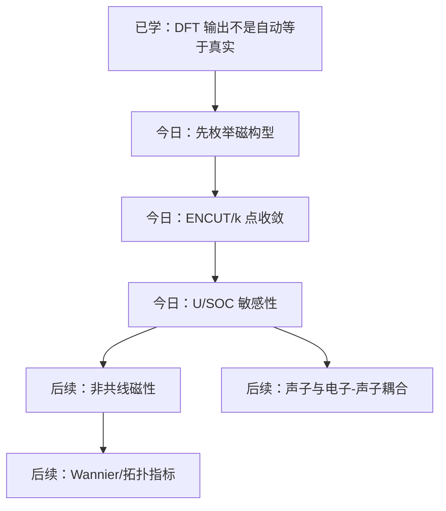

# 磁性材料第一性原理入门：不要先按按钮，先枚举磁构型

## 快速阅读版

**核心结论：** 做磁性体 DFT，第一步不是打开软件跑一个默认设置，而是先问：这个材料可能有哪些磁构型？我是否比较了这些构型的能量，并确认结果对截断能、k 点、U、SOC 等设置收敛？

**今天为什么重要：** Kagome/frustration 材料常有多个接近能量的磁态。你只算一个初始磁矩，很容易把“计算收敛到某个局部解”误认为“材料真实基态”。

**读完要掌握：** 磁性计算可信度来自候选态枚举 + 数值收敛 + 物理交叉验证，而不是来自软件输出了一个总能量。

## 摘要

DFT 可以计算给定结构和近似泛函下的电子基态。  
磁性材料需要额外指定或探索自旋自由度。  
对 frustrated/Kagome 体系，多个磁构型可能能量很接近，单次计算不可靠。  
ENCUT、k 点、赝势、U、SOC、结构优化标准都会影响能量差。  
可信计算必须报告参数、收敛测试、候选磁态和与实验/文献的对照。

## 目录

- 证据清单
- 这个计算问题想回答什么
- 具体工作流
- 参数怎么调
- 如何验证真实性
- 术语表
- 作者/团队可信度
- 计算如何服务合成判断
- 数据分析流程
- 计算与实验设备盘点
- 今日技能点

## 证据清单

**VASP Wiki: Magnetism Tutorial**  
用途：VASP 中磁性、LSDA+U、SOC 等实践入口。  
链接：<https://vasp.at/wiki/Magnetism_-_Tutorial>

**VASP Wiki: ENCUT**  
用途：ENCUT 含义及必须检查收敛的官方说明。  
链接：<https://www.vasp.at/wiki/ENCUT>

**VASP Wiki: Energy cutoff and FFT meshes**  
用途：截断能、FFT 网格和能量差收敛的说明。  
链接：<https://vasp.at/wiki/Energy_cutoff_and_FFT_meshes>

**arXiv: k-points and cutoff convergence in high-throughput DFT**  
用途：k 点和 cutoff 收敛测试的研究线索。  
链接：<https://arxiv.org/abs/1809.01753>

## 今日主文档：原文阅读训练

**主文档**  
VASP Wiki: _Magnetism - Tutorial_  
Link: <https://vasp.at/wiki/Magnetism_-_Tutorial>

**为什么选它**  
第一天不适合直接读一篇复杂计算论文。先读官方文档可以训练你识别最基本的计算词汇：MAGMOM（初始磁矩 / 初期磁気モーメント）、spin-polarized calculation（自旋极化计算 / スピン分極計算）、DFT+U（DFT+U / DFT+U）、SOC（自旋轨道耦合 / スピン軌道相互作用）。这些词以后会在论文方法部分反复出现。

**怎么读这个文档**

1. 先找 magnetic moments（磁矩 / 磁気モーメント）  
   问自己：作者是如何给初始磁矩的？这只是初始猜测，还是最终物理结论？

2. 再找 DFT+U（DFT+U / DFT+U）  
   问自己：U 值从哪里来？有没有做 U sensitivity（U 敏感性 / U依存性）？

3. 再找 SOC（spin-orbit coupling，自旋轨道耦合 / スピン軌道相互作用）  
   问自己：为什么这个材料需要 SOC？是因为重元素、磁各向异性，还是拓扑能带？

4. 最后回到论文方法部分  
   以后读计算论文时，你要能快速找到：ENCUT（平面波截断能 / 平面波カットオフエネルギー）、k-point mesh（k 点网格 / k点メッシュ）、convergence criterion（收敛判据 / 収束条件）、pseudopotential（赝势 / 擬ポテンシャル）。

**今天要训练的英文词汇**

- spin-polarized calculation（自旋极化计算 / スピン分極計算）
- magnetic configuration（磁构型 / 磁気構造）
- initial magnetic moment（初始磁矩 / 初期磁気モーメント）
- plane-wave cutoff energy（平面波截断能 / 平面波カットオフエネルギー）
- k-point mesh（k 点网格 / k点メッシュ）
- convergence test（收敛测试 / 収束テスト）
- exchange-correlation functional（交换关联泛函 / 交換相関汎関数）

**阅读任务**

打开 VASP Magnetism Tutorial，找出 `MAGMOM` 相关段落。你今天只需要回答一个问题：`MAGMOM` 是最终磁矩，还是让计算开始搜索磁性解的初始条件？

## 这个计算问题想回答什么

对 Kagome/frustration 磁性体，第一性原理常想回答：

1. 哪些磁构型在能量上接近？
2. 是否存在明显的铁磁、反铁磁、非共线或螺旋磁倾向？
3. SOC 是否显著改变磁各向异性或能带拓扑？
4. DFT+U 是否改变绝缘/金属状态、磁矩大小或能量排序？
5. 计算结果是否和实验磁化率、中子散射、ARPES、STM、比热或输运相容？

## 具体计算流程

**1. 结构准备**  
要做什么：用实验晶体结构或可靠优化结构。  
为什么：错结构会让后面全错。

**2. 候选磁构型**  
要做什么：FM、简单 AFM、120 度、非共线、可能的超胞构型。  
为什么：frustrated 体系常有多个近能态。

**3. 基础收敛**  
要做什么：ENCUT、k 点、EDIFF、力收敛。  
为什么：总能量差可能很小，数值误差不能比物理差还大。

**4. 泛函选择**  
要做什么：PBE/PBEsol 等；必要时 DFT+U。  
为什么：过渡金属 d 电子常需检查 U 敏感性。

**5. SOC 检查**  
要做什么：重元素或拓扑/磁各向异性问题要开 SOC。  
为什么：SOC 可影响能带拓扑、磁各向异性和 DM 相互作用。

**6. 结果对照**  
要做什么：磁矩、能量差、带隙、态密度、实验量。  
为什么：防止漂亮图像没有物理意义。

## 参数怎么调

**ENCUT**  
控制：平面波基组大小。  
调大代价：计算更慢。  
检查方法：对总能量差、力、应力或目标物理量做收敛曲线。

**k 点网格**  
控制：布里渊区采样。  
调大代价：金属体系代价明显增加。  
检查方法：对能量差、DOS、费米面相关量做收敛。

**EDIFF / EDIFFG**  
控制：电子/离子收敛标准。  
调大代价：更慢但更稳。  
检查方法：检查能量、力是否达到目标精度。

**MAGMOM**  
控制：初始磁矩。  
调大代价：不直接增加太多成本。  
检查方法：多组初始值测试是否收敛到不同局部解。

**U 值**  
控制：局域 d/f 电子相关修正。  
调大代价：需要参数扫描和解释。  
检查方法：扫 U，观察磁矩、带隙、能量排序是否稳定。

**SOC**  
控制：自旋轨道耦合。  
调大代价：通常更慢，非共线更复杂。  
检查方法：比较开/关 SOC 的能带、能量、磁各向异性。

**不要记万能数值。** VASP 官方 ENCUT 页面明确强调目标物理量对 ENCUT 的收敛应当检查。k 点也同理，尤其金属和小能量差问题。

## 如何验证真实性

检查清单：

- [ ] 至少比较多个合理磁构型，而不是一个 MAGMOM。
- [ ] ENCUT 收敛到目标能量差所需精度。
- [ ] k 点网格对能量差和 DOS/能带关键特征收敛。
- [ ] 结构优化后的力和应力合理。
- [ ] 磁矩大小和价态化学直觉不矛盾。
- [ ] DFT+U 的 U 值来源明确，或做了 U 扫描。
- [ ] SOC 是否需要有物理理由。
- [ ] 与实验或前人文献至少做一个交叉对照。
- [ ] 报告了软件版本、赝势、泛函、输入关键参数。

## 前置知识地图

**量子力学**  
自旋、泡利原理、能级、哈密顿量。

**固体物理**  
晶体结构、倒格子、能带、费米能级。

**统计物理**  
基态、亚稳态、能量差、相变。

**计算物理**  
收敛、数值误差、局部极小。

**数值分析**  
参数扫描、误差容忍、网格采样。

**对称性**  
磁空间群、SOC、非共线磁性。

**实验表征**  
中子散射、ARPES、磁化率、输运。

## 核心术语

**密度泛函理论**  
English: density functional theory  
日本語: 密度汎関数理論  
新手解释：用电子密度而不是多电子波函数近似求基态性质。

**磁构型**  
English: magnetic configuration  
日本語: 磁気構造  
新手解释：晶胞/超胞中各原子磁矩的排列方式。

**平面波截断能**  
English: plane-wave cutoff energy  
日本語: 平面波カットオフエネルギー  
新手解释：限制平面波基组大小的能量阈值。

**k 点网格**  
English: k-point mesh  
日本語: k点メッシュ  
新手解释：倒空间采样网格，决定能带积分精度。

**DFT+U**  
English: DFT+U  
日本語: DFT+U  
新手解释：对局域 d/f 电子加入 Hubbard U 修正的近似方法。

**自旋轨道耦合**  
English: spin-orbit coupling  
日本語: スピン軌道相互作用  
新手解释：自旋和轨道运动耦合，可影响拓扑和磁各向异性。

## 代表来源与作者/团队可信度

**VASP Wiki**  
可信度：官方软件文档，适合确认 tag 含义和推荐工作流。  
风险：low；但示例不是所有体系通用。

**高通量 DFT 收敛文献**  
可信度：提供 k 点/cutoff 收敛统计视角。  
风险：medium；高通量标准不一定适合小能量差磁性问题。

**红旗审查：** 今天未发现 VASP Wiki 页面存在诚信问题。真正风险在用户误用：把默认 ENCUT、默认 k 点、单一 MAGMOM 当作可信结论。

## 同方向延伸阅读

**1. VASP Wiki: ENCUT**  
Link: <https://www.vasp.at/wiki/ENCUT>  
为什么值得读：理解 ENCUT（平面波截断能 / 平面波カットオフエネルギー）为什么必须收敛。  
难度：入门。  
风险备注：官方文档可信，但具体数值不能照搬。

**2. VASP Wiki: Energy cutoff and FFT meshes**  
Link: <https://vasp.at/wiki/Energy_cutoff_and_FFT_meshes>  
为什么值得读：理解 cutoff（截断 / カットオフ）和 FFT mesh（FFT 网格 / FFTメッシュ）如何影响能量和力。  
难度：入门/进阶。  
风险备注：官方文档可信；需要结合目标物理量。

**3. _Convergence and machine learning predictions of Monkhorst-Pack k-points and plane-wave cut-off in high-throughput DFT calculations_**  
Year: 2018  
Link: <https://arxiv.org/abs/1809.01753>  
为什么值得读：帮助你理解 k-point convergence（k 点收敛 / k点収束）和 cutoff convergence（截断能收敛 / カットオフ収束）不是装饰，而是计算可信度核心。  
难度：进阶。  
风险备注：高通量经验不等于小能量差磁性问题的最终标准。

**4. VASP Wiki: LSDAUTYPE**  
Link: <https://www.vasp.at/wiki/index.php/LSDAUTYPE>  
为什么值得读：DFT+U（DFT+U / DFT+U）会影响磁矩、带隙和能量排序，必须理解设置含义。  
难度：进阶。  
风险备注：官方 tag 文档可信；U 的物理选择仍需文献或约束计算支持。

## 这个方法能回答什么，不能回答什么

能回答：

- 给定近似下，不同磁构型的相对能量。
- 磁矩大小、态密度、能带、带隙趋势。
- SOC/DFT+U 对结果的敏感性。

不能直接回答：

- 强量子涨落下真实自旋液体基态。
- 有限温相变温度，除非再接模型和统计方法。
- 所有强关联效应，尤其 DFT 单粒子图像失效时。

## 小练习

如果一篇论文只说“we performed spin-polarized DFT”，但没有说明磁构型、k 点、ENCUT、U、SOC、收敛标准，你应该怎么评价？

参考答案：这只能作为线索，不能作为强证据。至少要追问输入参数、候选磁态、收敛测试和实验/文献对照。

## 今日技能点与体系树

今天点亮：**磁性 DFT 的第一检查清单**。

## 下一篇建议主题

磁构型枚举：Kagome 三角形上的 FM、120 度、q=0、sqrt(3)x sqrt(3) 构型分别是什么意思？

## 可靠性备注

- **共识：** DFT 参数必须做收敛测试；磁性体系不能只依赖单个初始磁矩。
- **官方文档：** VASP Wiki 支持 ENCUT、磁性、DFT+U、SOC 等标签含义和教程。
- **计算实践：** 具体 ENCUT、k 点、U 值没有万能答案，必须围绕目标物理量收敛。
- **争议/局限：** 对量子自旋液体、强关联非常规超导，常规 DFT 只能给材料和能带层面的线索，不能直接证明多体基态。

## 计算如何反过来服务合成判断

材料合成不是和计算分开的。对 Kagome/frustration 材料，DFT 可以帮你形成合成假设，但不能替代实验。

可以辅助判断的事：

- formation energy（形成能 / 生成エネルギー）：目标相相对于竞争相是否大致合理。
- competing phases（竞争相 / 競合相）：如果计算或数据库显示某些二元/三元相很稳定，合成中就要警惕杂相。
- site preference（位点偏好 / サイト選好）：例如 Zn/Cu、V/Ta、Sb/Se 替换时，哪个位点更可能被占据。
- defect formation（缺陷形成 / 欠陥形成）：空位、替位、间隙原子可能如何影响载流子和磁性。
- lattice stability（晶格稳定性 / 格子安定性）：声子虚频可能提示结构不稳定或 CDW 倾向。

不能直接决定的事：

- 实验温度和时间不是 DFT 总能量直接给出的。它们涉及 kinetics（动力学 / 速度論）、diffusion（扩散 / 拡散）、nucleation（成核 / 核生成）、熔体黏度、挥发和容器反应。
- DFT 可以说某相热力学上可能稳定，但不保证你在某个炉温和 cooling rate（冷却速率 / 冷却速度）下能长出大单晶。
- 对 flux growth（助熔剂生长 / フラックス成長），计算很难直接告诉你最佳冷却曲线；需要结合相图、前人配比和试错。

读计算论文时的合成问题清单：

- 作者有没有说明样品来自 powder synthesis（粉末合成 / 粉末合成）、solid-state reaction（固相反应 / 固相反応）、hydrothermal synthesis（水热合成 / 水熱合成）、chemical vapor transport（化学气相输运 / 化学気相輸送）还是 flux growth（助熔剂生长 / フラックス成長）？
- 计算结构是 experimental structure（实验结构 / 実験構造），还是 fully relaxed structure（完全优化结构 / 完全緩和構造）？
- 如果实验样品有掺杂或缺陷，计算是否真的模拟了这些 disorder（无序 / 無秩序）？
- 计算预测的稳定相和实验 XRD/EDS 是否一致？
- 如果物性和计算不符，是模型错了，还是样品相纯度、位点混占、应力、缺陷出了问题？

## 数据分析流程：一条 DFT 结论是怎样建立的

**问题：哪个磁构型更值得作为候选基态？**

输入数据不是一句“做了 DFT”，而是一组明确的 crystal structure（晶体结构 / 結晶構造）、magnetic configuration（磁构型 / 磁気配置）、交换关联泛函、赝势、ENCUT、k-point mesh（k 点网格 / k点メッシュ）、收敛标准，以及是否包含 DFT+U 和 spin-orbit coupling（自旋轨道耦合 / スピン軌道相互作用）。

第一步输出通常是不同磁构型的 total energy（总能量 / 全エネルギー）与 local magnetic moment（局域磁矩 / 局所磁気モーメント）。分析过程不是只挑最低数字，而是先对每种构型都收敛，再检查提高 ENCUT、加密 k 点、改变初始磁矩或适当改变 `U` 后，能量排序是否稳定。如果两个构型只差极小能量，且差值与参数敏感性同量级，就只能说它们“接近竞争”，不能武断宣称唯一基态。

**问题：能带特征是否与 Kagome 物理相关？**

当磁构型和数值收敛得到基本控制后，才读 band structure（能带结构 / バンド構造）和 density of states（态密度 / 状態密度）。分析需要标注费米能级附近由哪些轨道贡献、加入 SOC 后简并或能隙如何变化、加入 `U` 后关键特征是否仍然存在。若论文声称 flat band（平带 / 平坦バンド）或 Dirac point（狄拉克点 / ディラック点），应要求图中能看到其位置，并确认它不是由不合理结构、粗 k 点或任意参数造成。

**问题：计算能否确认实验结论？**

把计算结果和实验 observable（可观测量 / 観測量）对接：XRD 给结构，ARPES 可与计算能带比较，磁化和中子散射约束磁序，输运或比热提供转变线索。计算能帮助解释“某种结构/磁构型下可能出现的电子特征”；常规 DFT 本身不能确认量子自旋液体，也不能单凭能带确认非常规超导配对机制。

**你应该保存的数据证据包**

- 输入结构来源、原始输入文件、软件版本与赝势/泛函选择。
- 所有候选磁构型的输入初始磁矩、收敛后的磁矩和相对总能量。
- ENCUT 与 k 点收敛曲线，以及 `U`/SOC 敏感性结果。
- 对应实验数据的来源链接，以及计算与实验吻合和不吻合之处。
- 最终结论分级：数值收敛支持；对参数敏感；需要实验确认；现有数据不能判断。

**读图练习**

看到论文的一张能带图时，先找方法段是否报告构型、SOC、`U`、k 点和结构来源；再找是否有参数敏感性或与 ARPES/实验的比较。如果没有，漂亮的能带图只能作为假说生成工具，证据等级不能自动提升。

## 计算与实验所需设备盘点

第一性原理的“仪器”一部分是计算设施，另一部分是用来验证它没有解释错样品的实验设施。下面是做 Kagome 磁性/超导问题前适合向实验室核对的能力清单，并不代表今天的 VASP 教程逐项使用了这些设备。

**计算侧必须确认**

- Linux/HPC cluster（高性能计算集群 / 高性能計算クラスタ）或足够的工作站资源，以及 VASP 或替代 DFT 软件的合法可用性。
- 作业调度、存储与备份空间，用于保存结构、输出、收敛测试和可复现记录。
- 后处理工具：能带/DOS/磁矩/声子/可视化分析工具；做拓扑或 Wannier 分析时还需相应软件能力。

**样品和结构验证侧应确认**

- powder or single-crystal XRD（粉末或单晶 XRD / 粉末または単結晶XRD），用于确认计算采用的结构是否对应真实样品。
- EDS/WDS 或 ICP-OES（元素分析 / 元素分析），用于检查实际成分、替位和缺陷线索。
- Laue diffraction（劳厄衍射 / ラウエ回折），当计算要和定向单晶输运或谱学比较时确认晶向。

**物性和电子结构验证选项**

- PPMS 四探针输运/比热平台与 SQUID magnetometer（SQUID 磁强计 / SQUID磁束計），用于核查相变和磁响应。
- ARPES（角分辨光电子能谱 / 角度分解光電子分光），用于将计算能带与实验电子结构直接比较。
- STM、neutron scattering、NMR 或 muSR（缪子自旋旋转 / ミュオンスピン回転），用于进一步检查电荷调制、磁序或局域磁响应；这些通常需要合作或大设施申请。

对于你准备开展的项目，最先要确认的不是“有没有最豪华的表征”，而是：能否可靠确认相纯度和组成；能否测基本磁性/输运；计算结果是否能回到真实样品上被质疑和验证。
