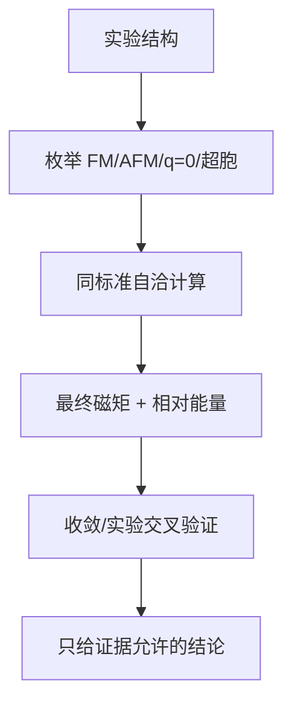

# 先定义问题再算能量：Kagome 磁构型枚举的第一份计算方案

## 快速阅读版

对于 Kagome magnet（Kagome 磁体 / カゴメ磁性体），一次 spin-polarized calculation（自旋极化计算 / スピン分極計算）并不等于找到真实磁态。你必须先提出候选：

- FM（ferromagnetic，铁磁 / 強磁性）。
- 简化 collinear AFM（共线反铁磁 / 共線反強磁性），用于基线比较。
- `120 degree q=0` noncollinear state（非共线态 / 非共線状態）。
- 如果研究需要，再加入 `sqrt(3) x sqrt(3)` 超胞构型。

计算真正产出的数据是每个候选经同等数值标准收敛后的 relative total energy（相对总能量 / 相対全エネルギー）、final magnetic moments（最终磁矩 / 最終磁気モーメント）和电子结构。没有这套横向比较，最低能“结果”可能只是初始猜测造成的局域解。

## 今日主文档

**VASP Wiki: MAGMOM**  
Link: <https://www.vasp.at/wiki/MAGMOM>

**VASP Wiki: LNONCOLLINEAR**  
Link: <https://www.vasp.at/wiki/index.php/LNONCOLLINEAR>

为什么选它们：官方文档明确指出 `MAGMOM` 既提供初始在位磁矩，也影响对称性；最终磁态强烈依赖初始 `MAGMOM`。对 noncollinear magnetism（非共线磁性 / 非共線磁性），`LNONCOLLINEAR = True` 使计算处理完整的自旋密度矩阵。

## 物理问题翻译成计算问题

物理文章已经说过：Kagome 三角形的经典反铁磁最低能条件倾向于 120 度。计算上要问：

1. 在实验结构下，不同候选磁构型是否都能自洽收敛？
2. 其能量排序是否对 `ENCUT`、k 点和结构松弛稳健？
3. 最终磁矩是否保持预设的物理图案，还是塌到别的解？
4. 若实验没有磁长程序，周期有序 DFT 的能量比较能否只作为有效相互作用线索，而非真实基态证明？

## 构型怎样准备

**FM 基线**

为每个磁性原子给相同方向初始磁矩。它未必物理上正确，但为反铁磁候选提供能量参照。

**共线 AFM 基线**

在允许的超胞中给予正负初始磁矩。对于奇数三角形，它不能完全满足所有边，因此主要用于观察“强行共线”的代价。

**120 度 q=0**

需要 noncollinear calculation（非共线计算 / 非共線計算）。三个磁性位点可设置为平面内彼此相差 120 度的向量。VASP 官方文档说明，无 SOC 时能量取决于磁矩之间的相对方向，而不取决于整体相对于晶格的朝向。

**sqrt(3) x sqrt(3)**

需要更大的磁性超胞；代价是原子数与 k 点成本上升。与 q=0 比较时，要统一到相同的每化学式单位能量，并维持可比较的 k 点密度与数值精度。

## 数据分析流程：输出文件里看什么

**输入记录**

- 结构来自实验还是完全松弛后的理论结构。
- 每个构型的超胞、初始 `MAGMOM` 向量、是否启用 `LNONCOLLINEAR`。
- 赝势、泛函、`ENCUT`、k 点、收敛阈值。

**第一层结果：是否自洽收敛**

- 检查 electronic convergence（电子收敛 / 電子収束）和离子松弛是否达标。
- 输出最终局域磁矩；如果 q=0 初始化最后完全变形，不能仍将结果标作 q=0。

**第二层结果：相对总能量**

- 把所有候选转换成每公式单元或每磁性原子的相对能量。
- 只有当能量差明显大于数值收敛误差和参数敏感性，排序才有可信度。

**第三层结果：物理对照**

- 若实验中没有长程磁序，周期 DFT 最低能只说明平均场候选，不证明真实量子基态。
- 若中子散射给出特定短程关联，计算构型应与其比较，而不是只选最漂亮的能带图。

## 最小可复核任务单

```text
结构固定的初筛:
  FM
  collinear AFM baseline
  q=0 120 degree noncollinear
  optional sqrt(3) x sqrt(3) supercell

对每个候选保存:
  input structure and MAGMOM
  convergence log
  final local moments
  energy per formula unit
  ENCUT/k-mesh sensitivity
```

这不是可以直接提交到计算集群的参数配方，而是一份证据记录格式。真实计算参数必须由具体元素、赝势和目标精度决定。

## 仪器与计算资源盘点

**计算侧明确需要确认**

- 获授权的 VASP 或适合的替代代码使用权。
- Linux/HPC cluster 与作业调度系统；非共线/超胞扫描明显比单一共线计算更耗资源。
- 结构与输出的版本管理和存储。
- 可绘制能量比较、磁矩方向与结构的后处理工具。

**实验验证侧可能需要**

- XRD/Laue/元素分析：确认拿来计算的结构对应真实样品。
- SQUID 与 neutron scattering collaboration（中子散射合作 / 中性子散乱共同研究）：为磁态提供实验约束。

## 术语卡与来源

**initial magnetic moment（初始磁矩 / 初期磁気モーメント）**：数值求解启动的猜测，不是自动成立的实验事实。  
**noncollinear magnetism（非共线磁性 / 非共線磁性）**：不同位点磁矩不局限于同一直线。  
**relative total energy（相对总能量 / 相対全エネルギー）**：同一计算标准下候选态之间的能量差。  
**local minimum（局域极小值 / 局所極小値）**：自洽计算可能陷入的非全局最低解。

来源：

- VASP Wiki `MAGMOM`: <https://www.vasp.at/wiki/MAGMOM>
- VASP Wiki `LNONCOLLINEAR`: <https://www.vasp.at/wiki/index.php/LNONCOLLINEAR>
- Farnell et al. PRB 2011 for q=0/sqrt(3) comparison context: <https://doi.org/10.1103/PhysRevB.84.224428>

## 今日技能点

练习：如果 FM 与 q=0 的能量差只有很小数值，但改变 k 点后能量排序反转，你应该怎样表述结果？


