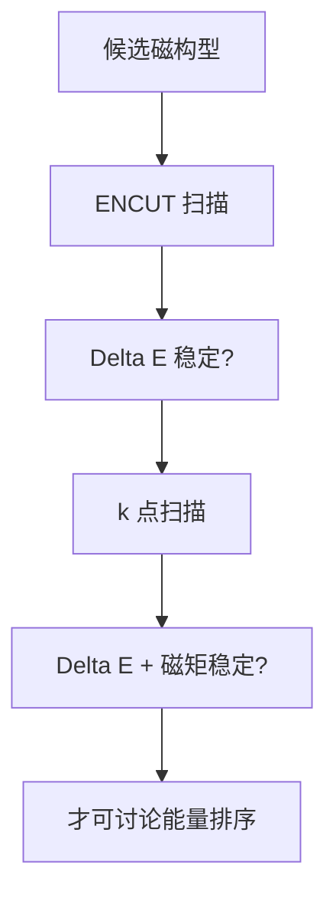

# 能量差可信吗：ENCUT 与 k 点收敛曲线怎样拦住伪结论

## 快速阅读版

昨天你枚举了多个 magnetic configurations（磁构型 / 磁気配置）。今天必须问一个不浪漫但决定生死的问题：两个构型差出的几 meV，到底是物理，还是 basis set（基组 / 基底関数系）和 Brillouin-zone sampling（布里渊区采样 / ブリルアンゾーン標本化）的数值误差？

`ENCUT` 决定平面波基组大小；`KPOINTS` 或 `KSPACING` 决定周期体系的 k 点采样。VASP 官方文档明确要求：对你真正关心的量检查 `ENCUT` 收敛，并指出 k 点采样收敛是电子最小化相关计算中的基本任务。

## 主文档与阅读目标

**VASP Wiki: ENCUT**  
<https://www.vasp.at/wiki/ENCUT>

**VASP Wiki: KPOINTS**  
<https://www.vasp.at/wiki/KPOINTS>

阅读时抓住两句话的意义：

- 默认值能让程序运行，不保证你的能量差已经可信。
- 若不同计算不使用一致精度，total energies（总能量 / 全エネルギー）不能放心比较。

## 先定义“收敛”的对象

很多新手只看单个构型总能量是否变化很小。但对 Kagome 磁性问题，你真正关心的通常是：

```text
Delta E = E(q=0) - E(FM)
```

或者：

```text
Delta E = E(sqrt(3)x sqrt(3)) - E(q=0)
```

即使两个绝对总能量都很大，决定磁态排序的是小小的差值。因此 convergence test（收敛测试 / 収束試験）必须追踪 `Delta E`、最终磁矩，必要时还追踪力、带隙或费米能级附近的 DOS。

## ENCUT 数据流程

**原始输出**

在一系列递增的 `ENCUT` 设置下，对同一组候选磁态分别得到总能量和最终磁矩。

**处理动作**

1. 保持赝势、结构、k 点、泛函和其他设置相同。
2. 将每个候选的能量转换为相同归一单位。
3. 对每个 `ENCUT` 计算 `Delta E`。
4. 画出 `Delta E versus ENCUT`，同时记录磁矩是否跳变。

**怎样判断**

- 如果 `Delta E` 在高 `ENCUT` 区域稳定且磁矩图案不变，你可以报告在指定阈值内收敛。
- 如果能量排序随 `ENCUT` 反转，当前证据不足以宣称磁基态。
- 如果最终磁矩突然变成另一个解，需分离“数值收敛”与“态发生改变”两个问题。

## k 点数据流程

二维 Kagome 材料与金属 Kagome 系统尤其要当心 k 点。金属费米面附近的积分对网格敏感；磁性超胞扩大后，k 网格还需按 reciprocal density（倒空间采样密度 / 逆空間サンプリング密度）调整。

**原始输出**

在一组越来越密的 Gamma-centered 或适当 Monkhorst-Pack meshes（k 点网格 / k点メッシュ）下得到候选态总能量。

**处理动作**

- 固定已够用的 `ENCUT`，只改变 k 点。
- 确保不同大小超胞的 k 点密度可比较，而非机械复制同一个数字。
- 对金属关注 smearing（展宽 / スミアリング）方案是否影响排序。

**结论边界**

一条看上去平滑的总能量曲线不够。你需要证明决定论文结论的差值和相关 observable（可观测量 / 観測量）已经稳定。

## 该保存什么数据

- 计算设置清单：POTCAR/赝势版本、泛函、结构、构型与超胞。
- `ENCUT -> E_FM, E_q0, Delta E, magnetic moments` 的记录。
- `k mesh -> E_FM, E_q0, Delta E, magnetic moments` 的记录。
- 判断阈值：例如你准备把何种能量变化视作不会改变物理解读。
- 对未收敛项目明确写“不能下结论”，不要只放最后一张漂亮图。

## 和实验数据怎么交叉认证

即便能量差数值收敛，DFT 候选磁态仍需要实验约束：

- XRD 与组成测量告诉你结构输入是否真实。
- neutron scattering 或 muSR 告诉你是否存在静态磁序。
- ARPES（对金属体系）可检查关键能带特征。

对于 herbertsmithite 这类可能没有普通磁长程序的体系，周期 DFT 能量差更像对有效相互作用的辅助探索，而不是 QSL 基态的直接证明。

## 计算资源与仪器盘点

- `计算必须`：HPC/工作站、DFT 软件授权、批量任务脚本、数据绘图工具和可追溯存储。
- `结构验证`：XRD、元素分析；否则收敛到的是不确定样品的理论结构。
- `磁性验证`：SQUID、muSR 或中子平台合作。
- `电子结构验证`：若未来进入 Kagome 金属，确认是否有 ARPES/STM 合作条件。

## 术语卡与来源

**plane-wave cutoff energy（平面波截断能 / 平面波カットオフエネルギー）**：决定纳入多少平面波的能量界限。  
**k-point mesh（k 点网格 / k点メッシュ）**：布里渊区积分的离散采样。  
**convergence curve（收敛曲线 / 収束曲線）**：目标量随数值精度设置变化的图。  
**energy ordering（能量排序 / エネルギー順位）**：候选态相对能量高低，只有在误差小于差异时才可信。

来源：

- VASP Wiki `ENCUT`: <https://www.vasp.at/wiki/ENCUT>
- VASP Wiki `KPOINTS`: <https://www.vasp.at/wiki/KPOINTS>
- Choudhary and Tavazza, convergence study preprint: <https://arxiv.org/abs/1809.01753>，用于进一步理解高通量环境下的 k 点/cutoff 评估，不作为本材料的现成参数表。

## 今日技能点

练习：论文报告 `q=0` 比 FM 低 `0.7 meV/formula unit`，但没有给 `Delta E` 随 k 点的曲线。你在笔记里应把这条结论标成什么风险等级，为什么？


