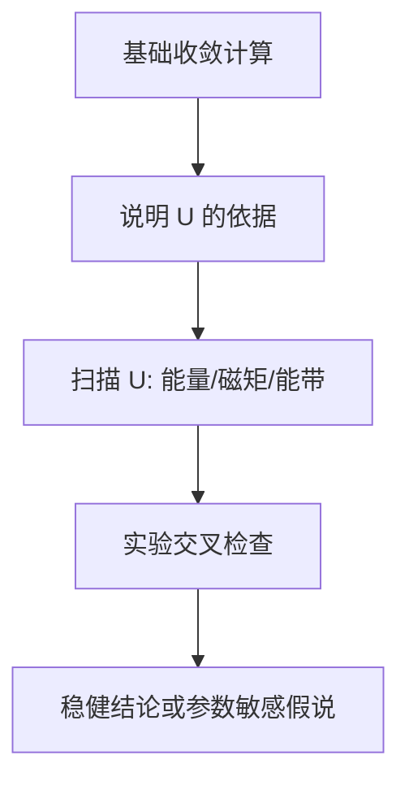

# U 不是调味料：过渡金属 Kagome 计算中 DFT+U 怎样被验证

## 快速阅读版

Kagome 磁体常包含 Cu、V、Fe、Co 等 transition-metal d electrons（过渡金属 d 电子 / 遷移金属d電子）。常规半局域 DFT 有时会过分离域化局域电子，于是研究者加入 DFT+U（DFT+U / DFT+U）修正。

危险在于：`U` 改变磁矩、能带、带隙和磁构型能量差。随便选一个让结果“像预期”的 `U`，不是验证，而是把结论调出来。可信做法是说明选择依据，展示 `U` sensitivity（U 敏感性 / U感度），必要时用 linear response（线性响应 / 線形応答）等方法估计有效参数，并与实验对照。

## 主文档

**VASP Wiki: LDAU**  
<https://vasp.at/wiki/LDAU>

**Cococcioni and de Gironcoli, _A linear response approach to the calculation of the effective interaction parameters in the LDA+U method_**  
Physical Review B 71, 035105 (2005)  
DOI: <https://doi.org/10.1103/PhysRevB.71.035105>  
Preprint: <https://arxiv.org/abs/cond-mat/0405160>

阅读目标：VASP 文档告诉你标签怎么实现；方法论文告诉你 `U` 可以作为对局域轨道占据响应的有效参数来估计，而不是只从别人文章复制。

## U 在修正什么

半局域泛函容易将局域化 d/f 电子描述得过于分散。Hubbard correction（Hubbard 修正 / ハバード補正）为选定轨道的双占据和局域相关加入能量惩罚。

对初学者最重要的不是先背公式，而是记住：

- `U` 只作用在你指定的轨道与元素上。
- 不同化学环境中的同种元素，有效 `U` 未必相同。
- 加 `U` 后必须重新验证磁构型、结构、电子结构与对实验的吻合程度。

## VASP 设置里容易遗漏的证据点

官方 `LDAU` 页面说明 `LDAU = .TRUE.` 打开 DFT+U，并涉及 `LDAUTYPE`、`LDAUL`、`LDAUU`、`LDAUJ`。官方还特别提醒：在 DFT+U 能带计算中固定读取 `CHGCAR` 时，对 d 元素需要相应提高 `LMAXMIX` 到 `4`，否则与自洽结果可能明显不一致。

所以你读计算论文时应立刻问：

- 作者用的是哪种 `LDAUTYPE` 或等效定义？
- `U` 与 `J` 施加在哪些原子/轨道？
- 能带是否按适合 DFT+U 的自洽/后处理流程生成？
- 论文有没有展示改变 `U` 后核心结论是否保留？

## 数据分析流程：怎样判断 U 选择不是随意的

**研究问题**

加入相关修正后，某个磁构型、带隙或电子特征是否稳健？

**原始计算数据**

- 多个 `U` 值下的 total energies、local magnetic moments、band structure/DOS。
- 若执行线性响应：对局域轨道施加扰动后，占据数变化的响应数据。
- 对应实验观测：磁矩、光谱、ARPES、绝缘/金属性质或交换尺度。

**处理步骤**

1. 固定结构、赝势、k 点和 `ENCUT`，先保证基础数值收敛。
2. 在物理有依据的 `U` 范围内扫描，而不是只展示一个点。
3. 比较候选磁态能量排序是否随 `U` 改变。
4. 比较关键 observable 是否趋向或偏离实验。
5. 如采用线性响应，明确轨道投影、超胞和响应定义。

**支持到哪里**

- 若能量排序和关键物理特征在合理 `U` 范围内不变，可称结论对 `U` 稳健。
- 若结论只在某个 `U` 出现，必须写作“参数敏感假说”，不能包装成确定发现。
- DFT+U 改善局域电子描述，不会自动解决量子自旋液体或非常规超导的完整多体问题。

## 连接 Kagome 材料的方式

对 Cu 基 herbertsmithite，计算可能探索结构、缺陷和有效交换，但真实 QSL 证据仍来自 NMR/中子等实验以及超越普通周期平均场的理论。

对 V 基 AV3Sb5 Kagome 金属，是否使用 `U` 与如何影响费米能级附近能带、CDW 或磁性倾向，需要分别论证；不能把“过渡金属存在”直接翻译为“必须加一个固定 U”。

## 资源与验证仪器

**计算资源**

- 支持 DFT+U 与批量参数扫描的软件和 HPC 资源。
- 保存每个 `U` 设置、占据矩阵与输出的可复现目录结构。
- 若要计算线性响应 `U`，需要额外超胞和扰动扫描预算。

**实验对照能力**

- XRD/元素分析：确认计算样品结构与组成。
- SQUID/中子/NMR：磁矩与交换相关验证。
- transport/ARPES/optical spectroscopy（输运/ARPES/光谱 / 輸送・ARPES・分光）：对金属和能带结论提供约束。

## 术语与来源

**Hubbard U（Hubbard U / ハバードU）**：对特定局域轨道相关作用的有效参数。  
**linear response（线性响应 / 線形応答）**：通过小扰动与占据变化估计有效交互参数的方法。  
**occupancy matrix（占据矩阵 / 占有行列）**：局域轨道占据状态的表示，在 DFT+U 实现中关键。  
**parameter sensitivity（参数敏感性 / パラメータ感度）**：结论随设定变化的程度。

来源：

- VASP Wiki `LDAU`: <https://vasp.at/wiki/LDAU>
- VASP Wiki `DFT+U` category: <https://vasp.at/wiki/Category%3ADFT%2BU>
- Cococcioni and de Gironcoli 2005: <https://doi.org/10.1103/PhysRevB.71.035105>

## 今日技能点

练习：一篇论文用 `U = 4 eV` 得到期望磁序，却没有解释选择理由，也没有展示其他 `U`。请写出三项你会要求作者补充的数据。

