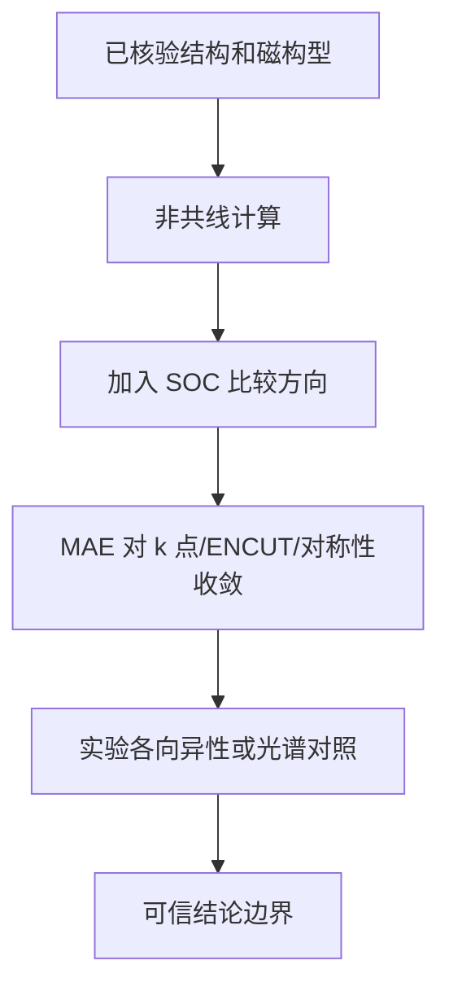

# 自旋开始认识晶格：SOC、非共线磁性与微小能量差的可信度

## 快速阅读版

不含 spin-orbit coupling（自旋轨道耦合 / スピン軌道相互作用）时，整体把所有磁矩一起旋转，能量通常不应知道它们相对于晶轴指向哪里；含 SOC 后，自旋自由度与晶格中的轨道运动耦合，in-plane（面内 / 面内）与 out-of-plane（面外 / 面外）取向可能产生不同能量。

这正是 magnetic anisotropy（磁各向异性 / 磁気異方性）、拓扑能带开隙和某些 Kagome 磁性问题的重要入口。可怕的是，这些能量差可能非常小；官方 VASP 文档明确警告 SOC 的能量差可在 $$\mu\mathrm{eV/atom}$$ 量级，k 点收敛困难且计算耗时很大。

## 主文档

**VASP Wiki: LSORBIT**  
<https://www.vasp.at/wiki/index.php/LSORBIT>

**VASP Wiki: LNONCOLLINEAR**  
<https://www.vasp.at/wiki/index.php/LNONCOLLINEAR>

**VASP Wiki: MAGMOM**  
<https://www.vasp.at/wiki/MAGMOM>

阅读重点：`LSORBIT = True` 会开启 SOC 并自动进入非共线处理；SOC 将自旋与晶格方向连接起来，因此方向能量比较才具有物理意义，但也必须更严格收敛。

## 从 120 度磁构型到 SOC

Kagome 三角形的 $$120^\circ$$ 构型本来就要求 noncollinear magnetism（非共线磁性 / 非共線磁性）。在不加 SOC 的理想计算中，你可以研究自旋之间的相对角度和能量。

加入 SOC 后，进一步能问：

- 这组三角形磁矩更偏好面内还是面外？
- 不同 chirality（手性 / カイラリティ）或整体旋转是否产生微小能量选择？
- SOC 是否在能带交叉处打开能隙，影响拓扑解释？

这些问题与真实 Kagome 磁体或金属的实验相关，但每一个都必须用收敛和实验对照守住结论边界。

## 数据分析流程：磁各向异性能量怎么建立

**计算对象**

选定一个已经经过基本验证的结构和磁构型，例如某个 120 度候选。不要在结构、`U`、k 点还不稳时直接开始比较微小 SOC 差值。

**原始数据**

- 同一结构/磁构型在不同整体取向下的 SOC total energy。
- 每个方向最终 magnetic moments、orbital moments（轨道磁矩 / 軌道磁気モーメント）和收敛日志。
- `ENCUT`、k 网格、对称性设置变化时的能量差。

**处理动作**

$$
\mathrm{MAE} = E(\text{direction A}) - E(\text{direction B})
$$

`MAE` 是 magnetic anisotropy energy（磁各向异性能 / 磁気異方性エネルギー）。由于它常远小于绝对总能量，需要：

1. 从可重复的电荷/波函数初态开始不同方向计算。
2. 确保 k 点集合和数值设置严格可比。
3. 测试关闭对称性是否改变结论；VASP 官方在 SOC 情况下特别建议检查 `ISYM=-1` 的影响。
4. 画出 MAE 对 k 点和 `ENCUT` 的收敛，而非只报告最终一数值。

**结论边界**

- 收敛稳定的 MAE 可支持偏好取向或磁各向异性大小。
- 若差值与数值漂移同量级，只能标记为未分辨。
- 即使计算显示 SOC 能带开隙，也要用 ARPES、磁输运或其他实验判断该特征是否在真实样品中存在。

## 读 VASP 输出时的危险信号

- 论文只写了 `SOC included`，没有说明磁矩方向与 `SAXIS`/构型。
- 不同方向用了不同 k 点或不同对称性约化，却直接比较微小能量。
- `U` 与 SOC 同时使用，但没有展示参数敏感性。
- 用周期有序 SOC 计算直接宣称量子自旋液体基态或超导配对机理。

## 对应实验仪器与设备清单

**计算侧**

- 可运行 noncollinear/SOC 任务的 VASP 许可与较充足 HPC 时间。
- 自动保持相同 k 点与参数的任务管理脚本。
- 可读取局域磁矩、轨道磁矩、能带与总能量差的分析工具。

**结构与磁性验证**

- XRD/Laue/EDS 或 WDS：样品结构、方向与组成。
- SQUID：各向异性磁化的初步检查。
- torque magnetometry（力矩磁测量 / トルク磁気測定）：研究各向异性时可能有用。
- polarized neutron scattering 或 resonant x-ray scattering（共振 X 射线散射 / 共鳴X線散乱）：更深入辨别磁结构，需要合作条件。

**电子/输运验证**

- ARPES 或 STM：若结论涉及 SOC 打开的能隙或表面电子态。
- Hall/磁输运平台：若结论涉及反常霍尔或拓扑响应。

设备是否实际由某篇论文使用，必须回到对应 experimental methods 查证；这里列的是你规划此类研究时应确认的资源层级。

## 术语与来源

**spin-orbit coupling, SOC（自旋轨道耦合 / スピン軌道相互作用）**：连接电子自旋与轨道/晶格方向的相对论修正。  
**magnetic anisotropy energy, MAE（磁各向异性能 / 磁気異方性エネルギー）**：不同磁矩取向间的能量差。  
**SAXIS（自旋量子化轴 / スピン量子化軸）**：VASP SOC/非共线表示中与方向解释相关的设置。  
**orbital moment（轨道磁矩 / 軌道磁気モーメント）**：SOC 情况下值得分析的输出量。

来源：

- VASP Wiki `LSORBIT`: <https://www.vasp.at/wiki/index.php/LSORBIT>
- VASP Wiki `LNONCOLLINEAR`: <https://www.vasp.at/wiki/index.php/LNONCOLLINEAR>
- VASP Wiki `MAGMOM`: <https://www.vasp.at/wiki/MAGMOM>

## 今日技能点

练习：某论文声称面内方向比面外低 $$3\ \mu\mathrm{eV/atom}$$，却只使用一个 k 网格。请列出你会要求查看的三张收敛/验证图。

