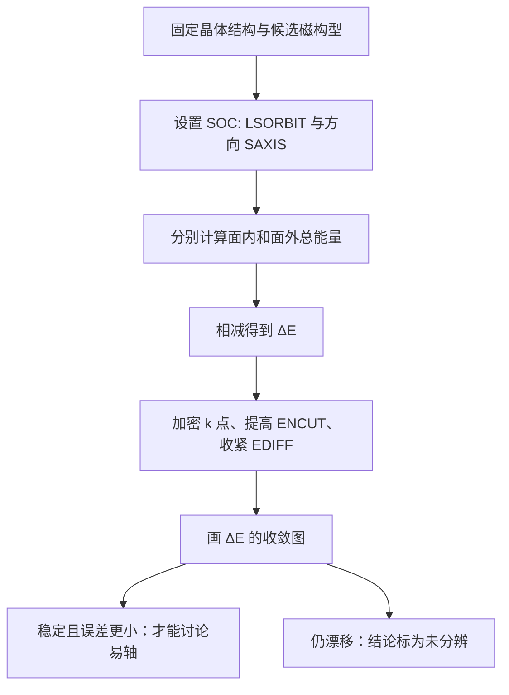

# 小到看不见的能量差可信吗：SOC 磁各向异性收敛图第一课

## 快速阅读版

昨天我们学到：加入 SOC（spin-orbit coupling，自旋轨道耦合 / スピン軌道相互作用）后，磁矩朝向晶体的不同方向可能具有不同总能量。今天只追问一个非常实际的问题：如果两个方向只差一点点能量，这一点点是真的吗？

VASP 官方 `LSORBIT` 文档直接提醒，SOC 下的能量差可以小到每原子几个 \\(\mu\mathrm{eV}\\)（微电子伏特 / マイクロ電子ボルト），k 点收敛会慢且困难。也就是说，计算程序输出了很多小数位，不代表其中每一位都具有物理可信度。

今日核心判断规则：**要比较多小的能量差，数值误差就必须比它更小，而且要用收敛图显示这一点。**

如果 DFT 仍完全陌生，先读入口：[DFT 从零开始：电脑到底在算什么]({{ '/methods/dft-zero-start/' | relative_url }})。

## 一、先认清这次计算在问什么

假设同一个晶体、同一个磁结构，只改变磁矩相对于晶格的方向：

- \\(E_{\parallel}\\)：磁矩在 Kagome 平面内时的总能量。
- \\(E_{\perp}\\)：磁矩指向平面外时的总能量。

定义一个能量差：

\\[
\Delta E = E_{\parallel} - E_{\perp}
\\]

- 如果 \\(\Delta E < 0\\)，在这一约定下，面内方向能量更低。
- 如果 \\(\Delta E > 0\\)，面外方向能量更低。
- 如果 \\(\Delta E\\) 与计算误差差不多大，诚实结论是“目前不能分辨哪个方向更稳定”。

这类差值称为 MAE（magnetocrystalline anisotropy energy，磁晶各向异性能 / 磁気結晶異方性エネルギー）。你不必先会推导量子力学；先记住它是“同一材料、不同磁矩方向之间的总能量差”。

## 二、计算仪器是什么：从输入文件到曲线

与 μSR 不同，这里没有向样品打入探针；“仪器”是一套受控计算与检查流程。



第一次读计算论文时，请逐项寻找：

- 结构是否固定、从哪里来，磁结构是否已经定义清楚。
- `LSORBIT` 是否开启；不同方向如何通过 `SAXIS` 或等价设置给出。
- 两个方向是否使用完全相同的数值条件。
- 是否展示 `k-point mesh`（k 点网格 / k点メッシュ）、`ENCUT`（平面波截断能 / カットオフエネルギー）和电子收敛阈值 `EDIFF` 的核验。

## 三、结果图长什么样：一张示意图的读法

下面不是任何真实材料的数据，而是一种你应要求看到的图表结构：

```text
ΔE (μeV/atom)
  8 |  x
  6 |
  4 |       x
  2 |                 x     x     x   <- 逐渐稳定在正值附近
  0 |------------------------------------------------
 -2 |
    +-------------------------------------------------> k 点越来越密
       4x4x1   6x6x1   8x8x1  10x10x1  12x12x1
```

如何读：

- 左侧数值变化很大：粗糙的 k 点会制造漂移，不能用来判断易轴。
- 右侧连续多个点保持同一符号并且变化幅度远小于目标差值：才开始有资格讨论方向偏好。
- 若曲线跨过零点、或最终差值只有 \\(2\\,\mu\mathrm{eV/atom}\\) 而最后两次设置仍变化 \\(3\\,\mu\mathrm{eV/atom}\\)，就不能宣称得到可靠易轴。

这一图只检验一个维度。严谨工作还应检查 `ENCUT`、`EDIFF`、对称性设置、占据/展宽方式，以及磁矩是否收敛到了同样可比较的物理状态。

## 四、VASP 官方文档真正说了什么

**主资料 1：VASP Wiki, `LSORBIT`**  
<https://www.vasp.at/wiki/index.php/LSORBIT>

该页面说明 `LSORBIT = True` 打开 SOC，并会自动设置非共线处理；SOC 将自旋自由度与晶格方向联系起来，因此面内与面外方向才可能产生能量不同。页面还特别警告：能量差可能仅为每原子几个微电子伏特，k 点收敛费时且必须格外谨慎。

**主资料 2：VASP Wiki, Including the Spin-Orbit Coupling**  
<https://www.vasp.at/wiki/index.php/Including_the_Spin-Orbit_Coupling>

官方教学示例用不同自旋方向比较 magnetocrystalline anisotropy energy，并展示了包含 `LSORBIT = .True.`、`SAXIS`、`ENCUT`、`EDIFF` 和 `KPOINTS` 的设置框架。示例是学习流程的入口，不是你的 Kagome 材料可以直接照抄的参数答案。

## 五、从文件到结论：证据链一步不能跳

**问题**  
SOC 是否让某个磁结构偏好面内或面外取向？

**计算对象**  
同一晶体结构、同一化学组成、同一候选磁排列，仅改变相对于晶格的整体方向。

**原始输出**  
每个方向的总能量、最终磁矩/轨道磁矩、电子迭代是否收敛以及参数日志。

**数据处理**  
对同一组参数计算 \\(\Delta E\\)，再依次提高 k 点密度、`ENCUT` 等精度；比较差值是否稳定而非只看一次结果。

**能支持的结论**  
若 \\(\Delta E\\) 的符号和数值在所声明的精度内稳定，可以在该模型与参数范围内报告方向偏好和能量尺度。

**不能支持的结论**  

- 没有收敛图时，不能把极小能量差当成可靠材料性质。
- 即使数值稳定，也不能自动证明实验样品一定采用该磁结构。
- SOC/DFT 的方向偏好不能单独证明量子自旋液体、拓扑态或超导机制。

## 六、你该向作者或自己的计算追问什么

- [ ] 两种方向是否使用同一结构、同一赝势、同一 `U`、同一 k 点与同一精度？
- [ ] `LSORBIT` 和方向设置是否明确，最后磁矩方向是否真的符合计划？
- [ ] \\(\Delta E\\) 对 k 点的曲线是否稳定？
- [ ] \\(\Delta E\\) 对 `ENCUT` 与 `EDIFF` 的曲线是否稳定？
- [ ] 差值是否大于最后几次加密造成的漂移？
- [ ] 对称性、展宽或初始磁状态变化后，结论是否仍保持？
- [ ] 若要联系真实材料，实验中是否存在可对照的磁各向异性或光谱信号？

## 七、容易误解的四个词

**SOC（自旋轨道耦合 / スピン軌道相互作用）**：使自旋方向能够“感知”晶格方向的相对论修正。  
**MAE（磁晶各向异性能 / 磁気結晶異方性エネルギー）**：改变磁矩方向导致的总能量差。  
**easy axis（易磁化轴 / 容易軸）**：在指定模型与条件下能量更低的磁矩方向。  
**convergence test（收敛测试 / 収束試験）**：提高计算精度，检查决定结论的量是否停止明显变化。

## 八、一个真正适合初学者的练习

某篇文章报告 \\(\Delta E=+3\\,\mu\mathrm{eV/atom}\\)，并称面外方向稳定；但它展示的最后三组 k 点结果依次为 \\(-2\\)、\\(+5\\)、\\(+3\\,\mu\mathrm{eV/atom}\\)。

请回答：

1. 符号是否已稳定？
2. 数值漂移是否小于最终报告差值？
3. 你会接受“面外方向稳定”的结论，还是要求更密 k 点与额外精度检查？

合理答案是：目前未分辨；因为差值和漂移同量级且曾换符号，继续检查前不应写成物理结论。

## 相关阅读与下一步

- VASP Wiki, `LSORBIT`：今日核心官方材料，难度中；先读“Symmetry and convergence”。<https://www.vasp.at/wiki/index.php/LSORBIT>
- VASP Wiki, `Including the Spin-Orbit Coupling`：带输入示例的官方练习入口，难度中。<https://www.vasp.at/wiki/index.php/Including_the_Spin-Orbit_Coupling>
- VASP Wiki, `SAXIS`：理解方向定义的后续文档，难度中高。<https://www.vasp.at/wiki/index.php/SAXIS>

本文使用的曲线与提问是教学示意，没有声称任何具体 Kagome 材料已经算出 MAE。可靠性风险等级：低到中；软件行为和警告来自官方文档，但将流程用于具体材料时仍必须以具体计算和实验对照为准。

下一步可进入 Wannier 化和 Kagome tight-binding 模型：在收敛可信的 DFT 能带基础上，学习怎样提取平带、Dirac 点与拓扑信息。
