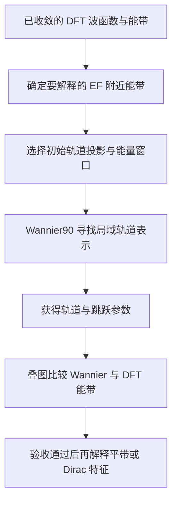

# 从 DFT 到 Kagome 小模型：Wannier 化到底在做什么

## 为什么需要这一步

物理篇告诉我们要在能带图里寻找平带、Dirac 点和 van Hove 奇点。但 DFT 计算往往给出许多挤在一起的曲线：你仍然会问，它们主要来自哪些原子轨道？哪些电子跳跃造成了这些形状？

**Wannier 化**就是一次翻译：把遍布晶体的能带描述，转成集中在原子或化学键附近的局域轨道，以及电子在这些轨道之间跳跃的模型。

## 五个基础词

| 名词 | 先这样理解 | 结果中看到什么 |
| --- | --- | --- |
| DFT 能带 | 第一性原理给出的电子能量路线 | 多条沿 `Γ -> K -> M` 起伏的曲线 |
| Wannier 函数 | 尽量聚集在局部位置的电子轨道 | 轨道图、中心、扩展大小 |
| tight-binding 模型 | 用站点能量与跳跃来描述关键电子 | 跳跃参数与插值能带 |
| 投影 | 告诉程序优先尝试哪些轨道 | 如 V 或 Co 的 d 轨道 |
| 能量窗口 | 规定最需要准确复现的能量范围 | 通常是 EF 附近 |

一句话模型可以先写成：`H = 站点自身能量 + 轨道之间的跳跃 + 必要时的自旋轨道耦合`。

## 实际计算流程

这条流程中最关键的是最后的叠图检查：程序运行完成并不自动等于模型可信。

## 第一张结果图怎样读：能带叠图

一张基本验收图会同时画出原始 DFT 能带与 Wannier 插值能带：

- 横轴常为 `Γ -> K -> M -> Γ`。
- 纵轴常为相对费米能级能量 `E - EF`。
- 在你选定的目标窗口内，两组曲线应尽量重合。
- 平带、Dirac 交叉或小开缝、van Hove 附近的转弯位置要特别检查。

| 看到的情况 | 应怎样处理 |
| --- | --- |
| 目标窗口内两组线重合良好 | 可继续用模型解释所选低能能带 |
| 远离目标区间处偏离 | 先看研究目标是否需要那一段 |
| EF 附近明显错位 | 不能用于低能结论，应重新选择窗口或轨道 |
| 交叉重现而小开缝消失 | 检查 SOC、磁构型、取样和轨道集合 |

## 为什么不能凭空选择一个简单模型

教学中最简单的 Kagome 模型可以只保留最近邻跳跃参数 `t`，它有助于理解典型形状怎样出现。但真实材料可能包含：

- 多个 d 轨道共同参与；
- 更远距离或层间的跳跃；
- 磁性与自旋轨道耦合；
- 与目标能带交缠的其他轨道。

所以，简单模型帮助形成直觉；经过叠图验收的 Wannier 模型才承担“连接具体 DFT 与实验”的责任。

## 结果的边界

| 已完成的验证 | 可以支持 | 不能自动证明 |
| --- | --- | --- |
| Wannier 插值复现目标 DFT 能带 | 模型适合描述所选计算能带 | 计算已与实验完全相符 |
| 模型包含平带或 Dirac 特征 | 可以分析轨道与跳跃来源 | 材料必然发生某种相变 |
| 加入 SOC 后出现开缝 | SOC 可能改变低能结构 | 拓扑结论已经完整验证 |

稳妥的顺序是：先让 DFT 本身收敛，再让 Wannier 模型重现 DFT，随后与 ARPES 等实验比较，最后才提出更强的物理解释。

## 今天的小练习

1. 为什么复杂 DFT 能带还需要翻译成 Wannier 模型？
2. 在叠图中，为什么先检查 EF 附近的目标窗口？
3. 若平带重合良好但 Dirac 小开缝不对，你最先怀疑哪些设置？

## 方法来源

- N. Marzari 与 D. Vanderbilt, *Maximally localized generalized Wannier functions for composite energy bands*, Physical Review B 56, 12847 (1997). [DOI](https://doi.org/10.1103/PhysRevB.56.12847)
- I. Souza, N. Marzari 与 D. Vanderbilt, *Maximally localized Wannier functions for entangled energy bands*, Physical Review B 65, 035109 (2001). [DOI](https://doi.org/10.1103/PhysRevB.65.035109)
- A. A. Mostofi 等, *wannier90: A tool for obtaining maximally-localised Wannier functions*, Computer Physics Communications 178, 685-699 (2008). [DOI](https://doi.org/10.1016/j.cpc.2007.11.016)
- [Wannier90 官方文档](https://wannier90.readthedocs.io/)

下一篇计算主线会进入声子和电子-声子耦合，说明怎样用计算去检查结构不稳定、电荷密度波与超导相关线索。
