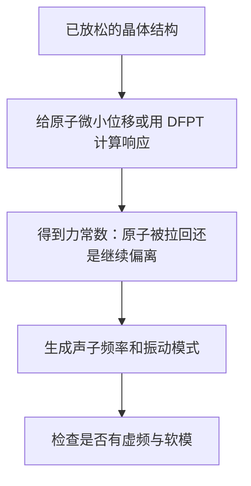
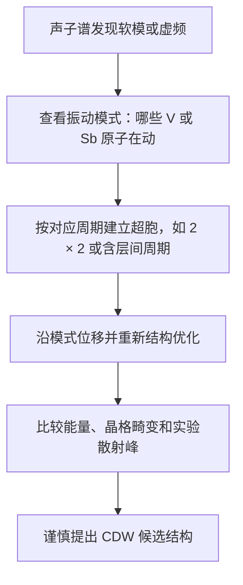

# 声子、结构不稳定和 EPC：怎样用计算接近 CDW 与超导

## 今天的问题

物理篇讲了 AV3Sb5 中的 CDW 与超导。计算上，我们要问：晶格本身是否想改变周期？电子和晶格振动之间是否强到足以影响超导？

| 名词 | 先这样理解 | 计算里看什么 |
| --- | --- | --- |
| 声子 phonon | 晶体中原子集体振动的量子化模式 | 声子色散图，即振动频率随声子动量变化 |
| 结构不稳定 | 某种原子位移会让结构能量降低，原结构不再稳 | 声子谱中出现虚频，或位移后能量降低 |
| EPC | 电子与原子振动互相影响的强度 | 耦合常数、谱函数、对超导温度的估计 |

今天不要求你会跑软件，而是会读第一张声子图，并知道它能证明什么、不能证明什么。

## 声子图来自什么

想象每个原子都被轻轻推一下。程序记录：推了哪个原子、往哪个方向推、其他原子受到怎样的恢复力。把这些响应整理起来，就能得到不同振动方式的频率。



DFPT 是密度泛函微扰理论。它在线性响应框架下计算小扰动后的电子与离子响应，不一定要把每个大超胞都显式挪一遍。

## k 点和 q 点先分清

| 符号 | 它标记什么 | 先这样记 |
| --- | --- | --- |
| k 点 | 电子波在晶体中的动量标签 | 读电子能带和费米面时常见 |
| q 点 | 声子或结构调制的动量标签 | 读声子谱、CDW 周期和散射峰时常见 |

如果论文说某个 q 点出现软模，意思是“这种空间周期的原子振动变得不稳定”。如果这个 q 点对应 `2 × 2` 周期，它就可能提示一个 CDW 候选结构。

## 第一张声子谱怎样读

横轴通常是声子 q 路径，例如 `Γ -> M -> K -> Γ`；纵轴是频率。每一条线代表一种集体振动模式。

```text
频率
 ↑
 |        正常模式：频率为正，结构对这种振动是稳定的
 |     ╱╲      ╱╲
 |____╱__╲____╱__╲_______
 |        0 线
 |----如果曲线掉到 0 线以下，常画成虚频或负频率区域
 +------------------------> 声子 q 路径
```

新手先看三点：有没有线掉到 0 线以下；掉下去的位置在哪里；对应的振动模式让哪些原子朝哪里动。

## 虚频不是“算坏了”的同义词

| 情况 | 该怎么判断 |
| --- | --- |
| 真实结构不稳定 | 增大超胞、沿虚频模式位移、重新放松后能量降低，并且结果对数值参数稳健 |
| 数值误差或设置问题 | k 点、q 点、能量截断、电子收敛、赝势、展宽、磁性或 SOC 设置改变后虚频消失 |

看到虚频时不要立刻宣布发现 CDW。正确动作是沿这个振动模式构造低对称结构，重新优化，再比较总能量、结构畸变和实验周期。

## 从虚频到 CDW 候选结构



即使某个结构计算能量更低，也还需要与散射、STM、ARPES 或输运等实验互相校验。

## EPC 为什么和超导有关

电子-声子耦合描述电子运动和原子振动之间互相影响的强度。传统 BCS/Migdal-Eliashberg 图像中，电子可通过晶格振动形成有效吸引，从而发生常规声子介导超导。

但有两个边界：有 EPC 不等于一定超导；有超导不等于一定完全由 EPC 解释。

## EPC 结果怎样读

| 结果量 | 先这样理解 | 新手常见误解 |
| --- | --- | --- |
| λ | 总体电子-声子耦合强度的汇总指标 | λ 大不自动等于预测一定正确 |
| α2F | 不同频率声子对 EPC 的贡献分布 | 峰高要结合声子频率和电子结构看 |
| Tc 估计 | 基于模型公式得到的超导温度估计 | 不是实验事实，也依赖有效电子排斥等参数 |
| 模式分解 | 哪些原子振动贡献最大 | 不能只看一个模式就忽略结构稳定性 |

最重要的文字关系是：`Tc 估计依赖 λ、声子频率尺度和有效电子排斥参数`。其中任何一个没控制好，结论都会晃。

## 对 AV3Sb5 的谨慎证据链

1. 高对称结构充分放松，并报告计算设置。
2. 声子谱对 k 点、q 点、展宽、能量截断和 SOC 等设置做过检查。
3. 虚频对应的振动模式被可视化，并与候选 CDW 周期一致。
4. 沿模式畸变后的结构能量更低，且畸变幅度合理。
5. EPC 结果说明哪些声子与哪些电子态贡献最大，而不是只给一个总数。
6. 与实验的 `T_CDW`、散射峰、STM 图样、ARPES 能带变化和 `Tc` 趋势比较。

## 常见坏结论清单

| 坏结论 | 为什么不够 |
| --- | --- |
| “有虚频，所以一定有 CDW” | 虚频可能来自数值设置，也可能不是实验观察到的周期 |
| “计算能量低，所以结构就是正确答案” | 还要看畸变模式、散射峰和样品条件 |
| “λ 不小，所以超导机制解决了” | Tc 估计依赖多个参数，且非常规贡献不能被排除 |
| “没有虚频，所以实验 CDW 不存在” | 计算近似、温度、无序、压力和电子关联都可能影响结果 |

## 参考方法来源

- S. Baroni 等，*Phonons and related crystal properties from density-functional perturbation theory*, Reviews of Modern Physics 73, 515-562 (2001). [DOI](https://doi.org/10.1103/RevModPhys.73.515)
- F. Giustino, *Electron-phonon interactions from first principles*, Reviews of Modern Physics 89, 015003 (2017). [DOI](https://doi.org/10.1103/RevModPhys.89.015003)
- P. Giannozzi 等，*QUANTUM ESPRESSO: a modular and open-source software project for quantum simulations of materials*, Journal of Physics: Condensed Matter 21, 395502 (2009). [DOI](https://doi.org/10.1088/0953-8984/21/39/395502)
- [Quantum ESPRESSO PHonon User’s Guide](https://www.quantum-espresso.org/Doc/user_guide_PDF/ph_user_guide.pdf)

下一篇计算主线会进入 Berry curvature 与拓扑指标，学习先验证模型再解释输运。
