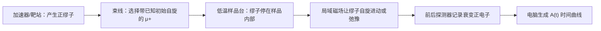

# μSR 是什么：用会衰变的微小探针寻找磁冻结

## 先说人话：它想问什么

一块磁性材料冷到很低温时，自旋可能像人群逐渐站定一样，形成静态或近乎静态的冻结状态；也可能始终在快速变化。对于 Kagome 材料，这个区别很重要：如果自旋很早就冻结成普通磁态，它作为量子自旋液体候选的解释就会变弱。

μSR（muon spin rotation/relaxation/resonance，缪子自旋旋转/弛豫/共振 / ミュオンスピン回転・緩和・共鳴）是一种 local probe（局域探针 / 局所プローブ）。它把带初始自旋方向的正缪子送入样品，然后借助缪子衰变时发出的正电子，间接读出缪子自旋随时间怎样变化。缪子感受到的局域磁场若变得静态或很慢，时间曲线通常会出现可辨识的变化。

## 仪器与过程：先认识路线图

这张图是教学流程，不是某篇论文设备照片。第一次看论文的方法部分，你要找的是：

- 样品是什么，最低温度是多少。
- 使用 zero field（零场 / ゼロ磁場）、longitudinal field（纵场 / 縦磁場）还是 transverse field（横场 / 横磁場）。
- 记录的时间范围和拟合模型是什么。
- 作者如何判断慢涨落、静态冻结和样品背景信号。

PSI（Paul Scherrer Institut）的官方介绍强调两点：正缪子到达样品时已经高度自旋极化；它衰变产生的正电子更倾向沿缪子自旋方向发射。因此探测器计数随时间的前后不对称，能够携带样品内部局域磁场的信息。

## 第一张结果图怎么读：\\(A(t)\\) 对时间

μSR 常画的量叫 asymmetry（不对称度 / 非対称度），可先把它理解为“缪子群体还保留多少可观察自旋方向信息”。通常把它写作：

\\[
A(t) = A_0 P(t)
\\]

- \\(t\\)：缪子进入样品后经过的时间，常以微秒计。
- \\(A_0\\)：仪器与样品几何决定的初始幅度。
- \\(P(t)\\)：缪子自旋极化随时间保留的程度。

读图时不要先盯着拟合公式，先看形状：

- 曲线缓慢、平滑地衰减：可能表示局域磁场主要仍在动态涨落，但具体结论需要拟合和对照。
- 很快丢失一部分幅度，或出现典型静态分布造成的形状变化：需要怀疑静态或准静态局域磁场出现。
- 加上沿初始自旋方向的小纵场后，如果衰减显著被“解耦”，通常有助于辨别静态场成分；若仍明显弛豫，动态涨落可能仍重要。

这里的“可能”很重要。一条曲线不能独自排除样品容器背景、缺陷、多个停驻位点或拟合模型选择造成的歧义。

## 以 herbertsmithite 为例：作者测了什么

**主论文**  
P. Mendels, F. Bert, M. A. de Vries, A. Olariu, A. Harrison, J.-C. Trombe, F. Duc, J. S. Lord, A. Amato and C. Baines, _Quantum Magnetism in the Paratacamite Family: Towards an Ideal Kagome Lattice_, Physical Review Letters 98, 077204 (2007).  
DOI: <https://doi.org/10.1103/PhysRevLett.98.077204>

论文研究 paratacamite 家族 \\(\mathrm{Zn}_x\mathrm{Cu}_{4-x}(\mathrm{OH})_6\mathrm{Cl}_2\\)，其中 \\(x=1\\) 对应 herbertsmithite。论文摘要报告：尽管其 Weiss temperature（外斯温度 / ワイス温度）约为 \\(300\\,\mathrm{K}\\)，\\(x=1\\) 样品在降到 \\(50\\,\mathrm{mK}\\) 时仍未观察到向磁冻结态的转变。

把这句话拆成证据链：

1. 问题：强反铁磁关联最终是否导致自旋冻结？
2. 样品：paratacamite 系列，并特别关注 \\(x=1\\) 的 Kagome 候选材料。
3. 工具：μSR，以低温下的局域磁场动态为观察窗口。
4. 可观察量：随时间变化的缪子自旋弛豫/不对称信号，以及不同组成和温度之间的比较。
5. 支持结论：在文中检测范围内，herbertsmithite 没有显示出磁冻结转变。
6. 不支持的跳跃结论：这一个实验本身不能唯一确定量子自旋液体的完整微观理论，也不能自动消除 Cu/Zn 缺陷的所有影响。

## 一分钟术语卡

**muon / μ+（正缪子 / 正ミュオン）**：寿命有限、能够植入材料的带正电轻粒子；其自旋可作为局域磁场探针。  
**spin relaxation（自旋弛豫 / スピン緩和）**：可观察自旋方向信息随时间变弱的过程。  
**magnetic freezing（磁冻结 / 磁気凍結）**：自旋在实验时间尺度上变成静态或非常缓慢的状态。  
**zero-field μSR（零场 μSR / ゼロ磁場 μSR）**：没有外加磁场时测量局域自发磁信号的模式。  
**longitudinal field（纵场 / 縦磁場）**：沿初始缪子自旋方向施加的磁场，常用于区分静态场和动态涨落。

## 你现在可以怎样读论文图

打开主论文时，先不要试图理解所有拟合参数。请按这个顺序：

- 标出哪个图展示 \\(x=1\\) 样品的低温 μSR 时间曲线。
- 看图例：温度是否降到毫开尔文尺度；是否包含比较组成或施加场的曲线。
- 问自己：作者所谓“未冻结”依赖的是曲线没有出现哪类静态信号？
- 在讨论部分寻找作者是否提到缺陷、停驻位点或对理论图景的限制。

## 阅读练习

假设一条低温 μSR 曲线弛豫增强了。请写出三种解释：自旋开始冻结、动态涨落变慢、样品缺陷/背景增多。然后说明还需要什么温度或外场对照，才有资格在三者中进一步区分。

## 来源与可靠性边界

- 主数据论文：Mendels et al., PRL 98, 077204 (2007), <https://doi.org/10.1103/PhysRevLett.98.077204>。
- 仪器原理官方说明：Paul Scherrer Institut, μSR Research, <https://www.psi.ch/en/lmu/research>。
- 本页流程图与读图提示属于教学解释，不是论文的原始图或对论文图的数字化复现。
- 风险等级：中。主论文是同行评议的一手文献，但对理想 Kagome 基态的完整判定仍需要结合 NMR、中子散射、结构与缺陷表征。
