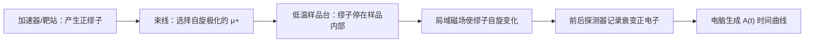

# μSR 是什么：用会衰变的微小探针寻找磁冻结

## 先说人话：它想问什么

一块磁性材料冷到很低温时，自旋可能像人群逐渐站定一样，形成静态或近乎静态的冻结状态；也可能始终在快速变化。对于 Kagome 材料，这个区别很重要：如果自旋很早就冻结成普通磁态，它作为量子自旋液体候选的解释就会变弱。

μSR（muon spin rotation/relaxation/resonance，缪子自旋旋转/弛豫/共振 / ミュオンスピン回転・緩和・共鳴）是一种 local probe（局域探针 / 局所プローブ）。它把有已知初始自旋方向的正缪子送进样品，然后借助缪子衰变产生的正电子，间接读出附近磁场是否变得静止或非常缓慢。

## 仪器与过程：先看路线

这张图是教学流程，不是某篇论文的设备照片。第一次看方法部分，先找四件事：样品和最低温度；零场还是外加场；时间曲线和拟合方式；作者怎样排除背景与缺陷造成的误读。

PSI 的官方介绍说明，正缪子到达样品时高度自旋极化，衰变产生的正电子更倾向沿缪子自旋方向发射。因此探测器计数随时间的前后不对称，可以携带样品内部局域磁场的信息。

## 第一张结果图怎么读：\\(A(t)\\) 对时间

常见入门表达式是：

\\[
A(t) = A_0 P(t)
\\]

- \\(t\\)：缪子进入样品后经过的时间，通常以微秒计。
- \\(A_0\\)：仪器和样品几何决定的初始幅度。
- \\(P(t)\\)：缪子自旋极化随时间保留的程度。

先读形状，再读拟合：缓慢平滑衰减可能与动态涨落相容；很快丢失幅度或出现静态分布特征，则需要怀疑静态或准静态局域磁场。加上沿初始自旋方向的纵场后，若衰减明显被解耦，通常有助于识别静态成分；若弛豫仍在，动态涨落可能重要。

但任何一种形状都仍需检查样品背景、缺陷、停驻位点和拟合选择，不能凭一条曲线直接宣布基态。

## 以 herbertsmithite 为例：论文回答到哪里

**主论文**  
P. Mendels et al., _Quantum Magnetism in the Paratacamite Family: Towards an Ideal Kagome Lattice_, Physical Review Letters 98, 077204 (2007).  
DOI: <https://doi.org/10.1103/PhysRevLett.98.077204>

论文研究的系列化学式可用文字写作 `Zn_xCu_(4-x)(OH)6Cl2`；其中 `x=1` 是 herbertsmithite。摘要报告：虽然相互作用尺度很强，`x=1` 样品降到 \\(50\\,\mathrm{mK}\\) 时仍未观察到向磁冻结态的转变。

把结论拆开：

1. 问题：强反铁磁关联最终是否导致自旋冻结？
2. 工具：μSR，用低温局域磁场动态作为窗口。
3. 可观察量：随时间变化的弛豫/不对称信号及不同温度、组成的比较。
4. 可支持的说法：在论文的测量范围内，herbertsmithite 未显示磁冻结转变。
5. 不可跳到的说法：该实验不能单独确定唯一的量子自旋液体理论，也不能消除 Cu/Zn 缺陷的全部影响。

## 一分钟术语卡

**muon / μ+（正缪子 / 正ミュオン）**：能植入材料且寿命有限的带正电轻粒子，其自旋可作局域探针。  
**spin relaxation（自旋弛豫 / スピン緩和）**：可观察自旋方向信息随时间变弱。  
**magnetic freezing（磁冻结 / 磁気凍結）**：自旋在实验时间尺度上变成静态或非常缓慢。  
**zero-field μSR（零场 μSR / ゼロ磁場 μSR）**：不加外磁场时寻找局域自发磁信号。  
**longitudinal field（纵场 / 縦磁場）**：沿初始缪子自旋方向施加、帮助区分静态场和动态涨落的磁场。

## 阅读练习与可靠性边界

如果低温曲线弛豫增强，请先列三种解释：发生磁冻结、动态涨落变慢、缺陷/背景贡献改变。再写出需要补看的温度、纵场或其他探针对照，才有资格进一步区分。

- 主数据论文：Mendels et al., PRL 98, 077204 (2007), <https://doi.org/10.1103/PhysRevLett.98.077204>。
- 仪器原理官方说明：Paul Scherrer Institut, μSR Research, <https://www.psi.ch/en/lmu/research>。
- 本页流程图与读图提示是教学解释，不是原始数据图。
- 风险等级：中。对理想 Kagome 基态的判断仍需结合 NMR、中子散射、结构与缺陷表征。
