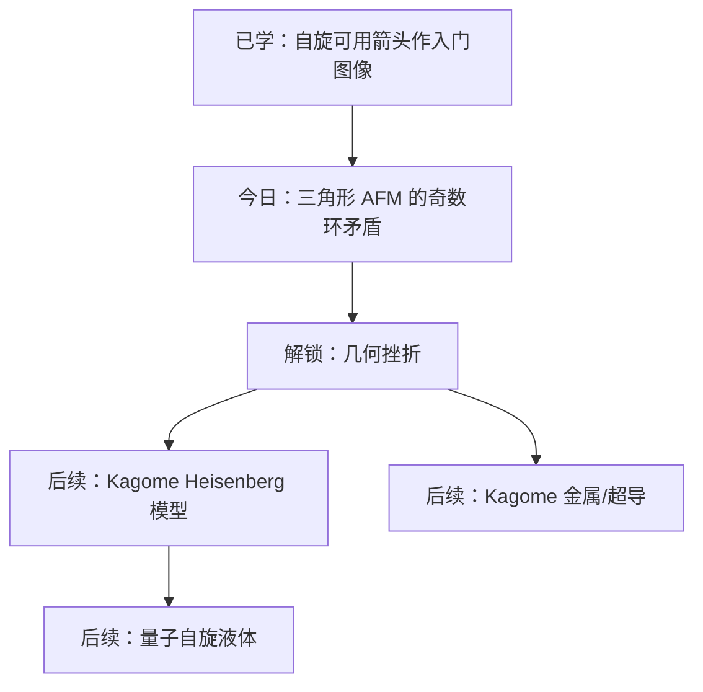

# Kagome 入门第一块砖：为什么三角形反铁磁会产生几何挫折

## 快速阅读版

**核心结论：** 反铁磁相互作用希望相邻自旋方向相反；但在三角形这种奇数环里，沿边走一圈每走一步都要翻转，回到起点时会要求一个自旋同时等于自己的反方向，所以不可能让所有边都满意。

**今天为什么重要：** Kagome 格子由角共享三角形组成。只要你理解一个三角形为什么挫折，就抓住了 Kagome 磁性体的第一层底层逻辑。

**读完要掌握：** 几何挫折不是“材料太乱”，而是晶格连接方式本身让最低能量条件互相冲突。

## 摘要

Kagome 格子是由角共享三角形构成的二维网络。  
如果相邻自旋之间是反铁磁相互作用，三角形的三条边无法同时满足“相邻相反”。  
这种由几何结构导致的冲突叫几何挫折。  
几何挫折会制造大量接近最低能量的自旋构型，使系统难以形成普通磁有序。  
在量子自旋体系里，这为量子自旋液体等非常规状态提供了舞台。

## 目录

- 证据清单
- 直觉图像
- 更精确的物理表述
- 前置知识地图
- 核心术语表
- 从底层原理看 Kagome
- 论文与作者可信度
- 合成视角
- 数据怎么走到结论
- 合成与验证仪器盘点
- 今日技能点

## 证据清单

**Kang et al., Nature Reviews Physics 2023**  
用途：Kagome 材料综述，说明 Kagome lattice 的基本性质和多种交织相。  
链接：<https://www.nature.com/articles/s42254-023-00635-7>

**Balents, Nature 2010**  
用途：自旋液体和 frustrated magnets 的综述背景。  
链接：<https://www.nature.com/articles/nature08917>

**Mendels and Bert, Comptes Rendus Physique 2016**  
用途：Kagome frustrated antiferromagnets 与 quantum spin liquids 的路线综述。  
链接：<https://www.sciencedirect.com/science/article/pii/S1631070515002467>

**Springer review on kagome Heisenberg model 2025**  
用途：Kagome Heisenberg antiferromagnet 作为 QSL 模型的近期综述线索。  
链接：<https://link.springer.com/article/10.1007/s44214-025-00084-6>

## 今日主论文：原文阅读训练

**主论文/主综述**  
_Quantum states and intertwining phases in kagome materials_  
Authors: Mingu Kang, Shiang Fang, Je-Geun Park, Riccardo Comin  
Year: 2023  
Link: <https://www.nature.com/articles/s42254-023-00635-7>  
arXiv: <https://arxiv.org/abs/2303.03359>

**为什么选它**  
今天是整个项目的入口日。与其直接啃某个很窄的实验论文，不如先读一篇 Kagome materials（Kagome 材料 / カゴメ材料）的高质量综述，建立地图：磁性、拓扑能带、强关联、CDW 和超导为什么会在同一个几何平台上相遇。

**怎么读这篇论文**

1. 先读 abstract（摘要 / 要旨）  
   目标不是背结论，而是圈出三个词：kagome lattice（Kagome 格子 / カゴメ格子）、frustration（挫折 / フラストレーション）、intertwining phases（交织相 / 絡み合った相）。

2. 再看 introduction（引言 / 序論）  
   找作者如何回答“为什么 Kagome 重要”。你会看到它不是单一材料家族，而是一种几何平台。

3. 看图，不急着看公式  
   重点找 Kagome geometry（Kagome 几何 / カゴメ幾何）、flat band（平带 / 平坦バンド）、Dirac point（Dirac 点 / ディラック点）、van Hove singularity（范霍夫奇点 / ファンホーブ特異点）这些图像线索。

4. 最后读你今天需要的部分  
   今天只需要把 geometric frustration（几何挫折 / 幾何学的フラストレーション）和磁性部分读懂。超导和拓扑部分先当作未来地图。

**今天要训练的英文词汇**

- kagome lattice（Kagome 格子 / カゴメ格子）
- geometric frustration（几何挫折 / 幾何学的フラストレーション）
- antiferromagnetic interaction（反铁磁相互作用 / 反強磁性相互作用）
- quantum spin liquid（量子自旋液体 / 量子スピン液体）
- flat band（平带 / 平坦バンド）
- Dirac point（Dirac 点 / ディラック点）
- van Hove singularity（范霍夫奇点 / ファンホーブ特異点）

**阅读任务**

打开主论文，读 abstract 和 introduction。读的时候只做一件事：把每一个你看到的 “kagome” 后面接的名词抄下来，例如 kagome magnets（Kagome 磁体 / カゴメ磁性体）、kagome metals（Kagome 金属 / カゴメ金属）。这会帮你建立领域词汇网。

## 直觉图像

先把自旋想成只能 `↑` 或 `↓` 的小磁针。反铁磁性要求相邻两个小磁针相反。

在一条链上很简单：

```text
↑ ↓ ↑ ↓ ↑ ↓
```

在正方形上也可以：

```text
↑ ↓
↓ ↑
```

但在三角形上：

```text
A ↑
B ↓
C ?
```

C 为了和 B 相反，应当是 `↑`。  
但 C 又和 A 相邻，而 A 已经是 `↑`。  
于是 C-A 这条边失败。

所以你的上一句话可以修成更物理的说法：

> 在奇数环上，如果每条边都要求反平行，沿环翻转奇数次后会与起点条件矛盾。

## 更精确的物理表述

最小模型常写成最近邻 Heisenberg 反铁磁模型：

$$
H = J \sum_{\langle i,j \rangle} \mathbf{S}_i \cdot \mathbf{S}_j,
\qquad J > 0
$$

这里：

- $$\mathbf{S}_i$$ 是第 $$i$$ 个格点上的自旋。
- `<ij>` 表示相邻格点对。
- $$J > 0$$ 表示反铁磁耦合。

在经典图像里，两自旋反平行能让 $$\mathbf{S}_i \cdot \mathbf{S}_j$$ 变小。
在三角形上，三条边都想要反平行，但几何上无法全部实现。Kagome 格子把这种三角形挫折复制到整个二维网络。

## 前置知识地图

**量子力学**  
自旋是量子角动量，不只是普通小箭头；今天先用箭头图像入门。

**固体物理**  
晶格决定哪些原子相邻，相邻关系决定相互作用网络。

**统计物理**  
系统低温时倾向寻找低能态；挫折会让低能态很多。

**凝聚态模型**  
Heisenberg 模型用一个哈密顿量描述自旋相互作用。

**实验技术**  
中子散射、NMR、muSR 可用于探测磁结构或自旋动力学。

**数学工具**  
奇偶性、图上的环、局域约束不能全局满足。

## 核心术语

**Kagome 格子**  
English: kagome lattice  
日本語: カゴメ格子  
新手解释：由角共享三角形构成的二维格子，像编织竹篮图案。

**反铁磁性**  
English: antiferromagnetism  
日本語: 反強磁性  
新手解释：相邻自旋倾向于反方向排列。

**几何挫折**  
English: geometric frustration  
日本語: 幾何学的フラストレーション  
新手解释：几何连接方式让局域最低能条件无法全部满足。

**量子自旋液体**  
English: quantum spin liquid  
日本語: 量子スピン液体  
新手解释：低温下仍不形成普通磁有序、保持强量子涨落的自旋态。

## 从底层原理看 Kagome

第一层：**局域愿望。**  
每条反铁磁边都希望两端自旋相反。

第二层：**奇数环矛盾。**  
三角形有三条边，是最小奇数环。若每走一条边都翻转一次，三次后回到起点会要求起点翻转成自己相反的方向。

第三层：**低能态增多。**  
既然不能让所有边都满意，系统会有很多“差不多不坏”的构型。这些构型能量接近，竞争强烈。

第四层：**量子涨落登场。**  
如果自旋是量子自旋，系统不一定选一个固定图案，而可能在许多构型之间强烈涨落。这就是 Kagome 反铁磁体与量子自旋液体联系的入口。

## 代表论文与作者/团队可信度

**Kang et al., 2023, _Quantum states and intertwining phases in kagome materials_**  
作用：Kagome 材料总览。  
作者/团队简评：综述文章，适合建立地图；作者来自活跃量子材料方向。  
风险：low。

**Balents, 2010, _Spin liquids in frustrated magnets_**  
作用：自旋液体经典综述。  
作者/团队简评：Leon Balents 是 frustrated magnetism / quantum matter 方向重要理论物理学家；今天未做完整争议审计。  
风险：low。

**Mendels and Bert, 2016**  
作用：Kagome frustrated antiferromagnets 路线综述。  
作者/团队简评：长期研究 Kagome 量子磁体实验；适合入门。  
风险：low。

**红旗审查：** 今天未发现这些代表综述有撤稿、Expression of Concern 或明确不端记录。注意：综述的可靠性来自其引用网络，但具体实验结论仍要回到原始论文。

## 同方向延伸阅读

**1. _Spin liquids in frustrated magnets_**  
Author: Leon Balents  
Year: 2010  
Link: <https://www.nature.com/articles/nature08917>  
为什么值得读：这是理解 spin liquid（自旋液体 / スピン液体）和 frustrated magnets（挫折磁体 / フラストレーション磁性体）的经典入口。  
难度：进阶。  
风险备注：综述性质，适合建立概念；具体材料结论仍要回原文。

**2. _Quantum kagome frustrated antiferromagnets: One route to quantum spin liquids_**  
Authors: Philippe Mendels, Fabrice Bert  
Year: 2016  
Link: <https://www.sciencedirect.com/science/article/pii/S1631070515002467>  
为什么值得读：更贴近 Kagome antiferromagnet（Kagome 反铁磁体 / カゴメ反強磁性体）的实验路线。  
难度：进阶。  
风险备注：综述，适合配合主论文读。

**3. _Colloquium: Herbertsmithite and the search for the quantum spin liquid_**  
Authors: Michael R. Norman  
Year: 2016  
Link: <https://journals.aps.org/rmp/abstract/10.1103/RevModPhys.88.041002>  
为什么值得读：真实 Kagome 候选材料 herbertsmithite（Herbertsmithite / ハーバーツミサイト）如何连接理想模型和实验问题。  
难度：进阶。  
风险备注：RMP 综述，可信度较高；材料细节仍需注意杂质和实验限制。

## 实验实现或理论模型

理论上，最小入口是 Kagome 最近邻 Heisenberg 反铁磁模型。  
实验上，herbertsmithite `ZnCu3(OH)6Cl2` 常被作为接近 `S=1/2` Kagome 反铁磁体的候选体系讨论。它不是“完美模型”，实际材料会有杂质、自旋轨道耦合、Dzyaloshinskii-Moriya 相互作用等修正。

## 与知识树的连接

```text
奇数环反铁磁
  -> 几何挫折
    -> Kagome Heisenberg antiferromagnet
      -> 量子自旋液体候选
      -> 真实材料修正项
      -> 后续连接：Kagome 金属、平带、van Hove、超导
```

## 小练习

用一句话解释：为什么正方形反铁磁不挫折，而三角形反铁磁挫折？

参考答案：正方形是偶数环，沿环交替 `↑↓↑↓` 回到起点不矛盾；三角形是奇数环，翻转三次后会要求起点变成自己的反方向。

## 今日技能点与体系树

今天点亮：**奇数环反铁磁挫折**。



## 下一篇建议主题

Heisenberg 模型：为什么 $$H = J \sum_{\langle i,j \rangle} \mathbf{S}_i \cdot \mathbf{S}_j$$ 是理解 Kagome 磁挫折的第一条公式？

## 可靠性备注

- **共识：** 三角形反铁磁的几何挫折是教材级直觉和 frustrated magnetism 综述中的基础内容。
- **论文结论：** Kagome 材料中存在多类交织相，见 Kang et al. 综述；具体材料结论需逐篇回原文。
- **解释：** `↑/↓` 图像是入门类比；真实 Heisenberg 自旋可以连续取向，量子自旋还涉及叠加和涨落。
- **待确认：** 作者画像今天只做了入门级核验，不等于完整诚信审计。

## 合成视角：材料为什么要这样长出来

今天主线是 geometric frustration（几何挫折 / 幾何学的フラストレーション），但真正做材料时，frustration 能不能被看见，首先取决于样品是不是目标相、有没有 impurity phase（杂相 / 不純物相）、有没有 site mixing（位点混占 / サイト混合）。

**例子 1：herbertsmithite（ZnCu3(OH)6Cl2）**

这类 Kagome antiferromagnet（Kagome 反铁磁体 / カゴメ反強磁性体）常见路线是 hydrothermal synthesis（水热合成 / 水熱合成）。水热路线的直觉是：氢氧化物/氯化物框架不适合简单高温烧结，因为太高温可能分解、脱水或生成别的铜氧氯相；水热环境能在较低温度和自生压力下慢慢重排离子，让目标层状羟基氯化物相形成。

合成时真正要盯的是 site mixing（位点混占 / サイト混合）。如果 Zn 和 Cu 的位置混乱，实验看到的低温磁响应可能有一部分来自杂质自旋，而不是理想 Kagome 层本身。因此，合成路线不只是“做出粉末”，而是要尽量控制晶体化、阳离子分布和杂质相。

**例子 2：CsV3Sb5 / AV3Sb5 Kagome 金属**

很多 CsV3Sb5 单晶使用 self-flux method（自助熔剂法 / セルフフラックス法）或 Sb flux（Sb 熔剂 / Sbフラックス）。直觉是：Sb 既是组成元素，又可以作为 flux（助熔剂 / フラックス）帮助晶体在高温熔体中慢慢长大。相比直接 solid-state reaction（固相反应 / 固相反応），flux growth（助熔剂生长 / フラックス成長）更适合获得可解理的 single crystal（单晶 / 単結晶），方便 ARPES、STM、输运和磁化测量。

温度和时间为什么重要？

- 温度太低：反应物扩散慢，目标相可能长不出来，或者只形成小晶粒/杂相。
- 温度太高：volatile/reactive element（挥发/活泼元素 / 揮発性・反応性元素）、容器兼容性和非目标相风险都会增加。
- 保温时间：给熔体均匀化和目标相成核/长大的时间。
- 慢冷：通常有利于大晶体长大；CsV3Sb5 相关文献中也能看到 cooling rate（冷却速率 / 冷却速度）和样品质量指标如 RRR（residual resistivity ratio，剩余电阻比 / 残留抵抗比）被联系起来讨论。

给你自己做合成的启发：

1. 先问目标相是否含 volatile/reactive element，比如 Cs、K、Rb 这类碱金属。
2. 再问目标是 powder（粉末 / 粉末）还是 single crystal（单晶 / 単結晶）。粉末适合相图和初筛；单晶更适合各向异性、ARPES、STM 和精细输运。
3. 看论文 synthesis（合成 / 合成）部分时，不要只抄温度。要问：这个温度在相图里可能对应什么液相/固相区域？这个时间是在促反应完全，还是在促晶体长大？
4. 物性异常要回头查样品质量：XRD、Laue、EDS/WDS、RRR、磁化率转变宽度、超导体积分数。

安全边界：这只是合成思路分析，不是操作规程。涉及 sealed ampoule（封管 / 封管）、高温、真空、碱金属、Sb/Se 等元素时，需要实验室 SOP、导师确认和安全设备。

## 数据怎么走到结论：第一次读实验图的路线

今天的主文献是 review article（综述文章 / 総説論文），它负责画地图，不是一组单独样品的 primary dataset（原始研究数据 / 一次研究データ）。所以这里不能冒充“这篇综述亲自测得了某条曲线”。正确读法是：先知道一个 Kagome 结论通常需要哪些数据，再去原始实验论文逐图核查。

**问题 1：样品是不是目标 Kagome 相？**

原始数据通常是 powder X-ray diffraction（粉末 X 射线衍射 / 粉末X線回折）或 single-crystal X-ray diffraction（单晶 X 射线衍射 / 単結晶X線回折）图谱。研究者把测得衍射峰与结构模型的 calculated pattern（计算谱形 / 計算パターン）比较，做 refinement（结构精修 / 構造精密化），检查主要峰能否由目标结构解释，也检查是否存在额外 impurity peaks（杂相峰 / 不純物ピーク）。

它能支持的结论是“样品主要符合某种晶体结构”；它单独不能证明“该样品实现了量子自旋液体”或“超导机理来自 Kagome 电子结构”。如果额外峰、位点占据率或误差指标没有报告，后面的磁性结论要先保留怀疑。

**问题 2：看到的低温磁响应来自理想 Kagome 层，还是缺陷？**

对于 herbertsmithite 一类磁体，要看 magnetic susceptibility（磁化率 / 磁化率）、specific heat（比热 / 比熱）以及可能的 NMR（核磁共振 / 核磁気共鳴）或 neutron scattering（中子散射 / 中性子散乱）数据。分析过程常包括扣除背景、比较不同温区、拟合 Curie-like impurity tail（居里型杂质尾项 / キュリー型不純物テール），并把 bulk measurement（体测量 / バルク測定）与局域探针的信号互相对照。

如果体磁化率在低温上翘，而局域探针指向 Kagome 层内响应没有相同强度的上翘，一种合理解释是 site mixing（位点混占 / サイト混合）产生了近似自由的杂质自旋。这里支持的是“缺陷显著影响低温数据”；它并不自动证明理想层的最终量子基态。

**问题 3：AV3Sb5 中一个相变信号是否真实？**

对 CsV3Sb5 这类金属，常见证据链是 electrical resistivity（电阻率 / 電気抵抗率）、magnetic susceptibility（磁化率 / 磁化率）、specific heat（比热 / 比熱）先发现异常温度，再由 ARPES（角分辨光电子能谱 / 角度分解光電子分光）或 STM（扫描隧道显微镜 / 走査トンネル顕微鏡）观察电子结构或实空间调制。研究者需要说明转变温度如何从曲线提取、不同样品是否重复、异常是否随样品纯度或 RRR 改变。

一条电阻率拐点只能支持“发生了某种散射或电子态变化”；把它命名为 charge-density wave（电荷密度波 / 電荷密度波）通常还需要与超结构峰、STM 周期调制或其他光谱证据交叉认证。

**给你的图表阅读动作**

打开下一篇原始实验论文时，先不要读结论。先找到三类图：结构/纯度图、低温异常图、能确认微观机制的探针图。对每张图写下四句话：测的是什么；横纵轴是什么；作者做了什么处理；这张图最强能证明到哪里。这样你读到的不是“漂亮故事”，而是一条可以拆开的证据链。

## 合成与验证仪器盘点：先确认实验室有没有

以下清单不是声称某一篇论文逐项使用过的完整设备表。`原文明确或通常随数据出现` 表示应回到原文 methods/supporting information 确认型号和条件；`路线可能需要` 表示你准备类似实验前应向实验室核实的能力。

**Hydrothermal synthesis（水热合成 / 水熱合成）方向，例如 herbertsmithite**

- `路线可能需要`：hydrothermal autoclave（水热反应釜 / 水熱オートクレーブ）及合适内衬，用于承受反应温度下的自生压力；必须确认温压额定范围和安全培训。
- `路线可能需要`：analytical balance（分析天平 / 分析天秤）、通风橱、基础研磨/混料工具，以及干燥或低温热处理设备，用于配料和后处理。
- `验证必须优先确认`：powder XRD（粉末 X 射线衍射 / 粉末X線回折），先判断目标相和杂相。
- `进一步验证选项`：single-crystal XRD（单晶 XRD / 単結晶XRD）、ICP-OES/EDS/WDS（元素组成分析 / 元素組成分析），用于检查元素比例和位点混占线索。
- `物性验证选项`：SQUID magnetometer（SQUID 磁强计 / SQUID磁束計）、PPMS specific heat option（PPMS 比热模块 / PPMS比熱モジュール）、NMR 或中子散射平台，用于区分本征磁响应与缺陷影响。

**Flux growth（助熔剂生长 / フラックス成長）方向，例如 AV3Sb5**

- `路线可能需要`：inert-atmosphere glovebox（惰性气氛手套箱 / 不活性雰囲気グローブボックス），当原料含反应性强的碱金属时用于装样和转移。
- `路线可能需要`：高温可编程 furnace（可编程高温炉 / プログラム電気炉）、compatible crucible（兼容坩埚 / るつぼ）和 sealed ampoule capability（封管能力 / 封管設備）；需要确认温度上限、密封流程与安全资质。
- `路线可能需要`：centrifuge or decant setup（离心/倾析分离设备 / 遠心・デカント設備），若采用高温助熔剂分离路线，必须只按实验室成熟 SOP 操作。
- `验证必须优先确认`：XRD、Laue diffraction（劳厄衍射 / ラウエ回折）、EDS/WDS，用于检查结构取向、成分和杂相。
- `物性验证选项`：四探针电阻测量系统、PPMS、SQUID；更深入电子结构研究则需 ARPES 或 STM 合作平台。

你可以把这一段当成第一次向实验室问询的清单：先问有没有 XRD、炉子/反应釜/手套箱和基础物性设备，再问对应体系的安全许可、样品转移能力和外部合作表征渠道。设备齐全并不等于路线可行，缺失关键验证设备则很难判断合成是否真的成功。

## 合成方向延伸阅读

**_New kagome prototype materials: discovery of KV3Sb5, RbV3Sb5, and CsV3Sb5_**  
Authors: Brenden R. Ortiz and collaborators  
Year: 2019  
Link: <https://doi.org/10.1103/PhysRevMaterials.3.094407>  
为什么值得读：这是 AV3Sb5 Kagome 金属家族的材料发现入口，适合学习 synthesis（合成 / 合成）和 crystal growth（晶体生长 / 結晶成長）如何服务后续物性研究。  
难度：进阶。  
风险备注：材料发现论文，后续大量工作建立在该家族上；具体合成细节仍要看原文和补充材料。
