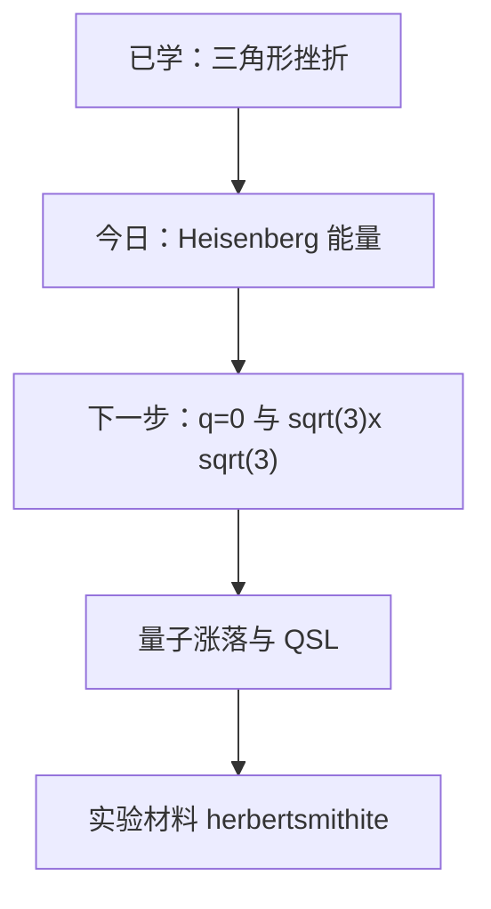

# 把挫折写成能量：Heisenberg 模型如何描述 Kagome 反铁磁

## 快速阅读版

昨天你用一句话看懂了 geometric frustration（几何挫折 / 幾何学的フラストレーション）：三角形里反铁磁边无法全都满意。今天我们把“满意”变成能量：

$$
H = J \sum_{\langle i,j \rangle} \mathbf{S}_i \cdot \mathbf{S}_j
$$

当 exchange constant（交换常数 / 交換定数）$$J > 0$$ 时，相邻自旋反平行会降低能量；三角形上三个连续可转动的经典自旋选择彼此约 $$120^\circ$$，因为这比强行做两个反平行、一个冲突更公平地分摊挫折。

这是一篇模型入门文章，不是一篇测量论文。它教你下一次看到磁化、比热或中子散射数据时，知道作者想从数据中反推出哪个哈密顿量。

## 今日主文献

**M. R. Norman, _Colloquium: Herbertsmithite and the search for the quantum spin liquid_**  
Journal: Reviews of Modern Physics 88, 041002 (2016)  
Link: <https://doi.org/10.1103/RevModPhys.88.041002>

为什么选它：它把 ideal kagome Heisenberg antiferromagnet（理想 Kagome Heisenberg 反铁磁体 / 理想カゴメハイゼンベルク反強磁性体）与真实材料 herbertsmithite 联系起来，并明确给出真实材料中交换作用很强但低温不发生普通磁有序的实验背景。

阅读任务：先读摘要，只圈出 `kagome lattice`、`exchange interaction`、`does not order` 三处表达。你暂时不需要理解自旋液体的全部含义，只需确认模型提出的核心问题。

## 公式从哪里来

**spin（自旋 / スピン）** 不是小球真的在自转，而是量子态携带的一种内禀角动量。入门时可以把其期望方向想成小磁针。

**exchange interaction（交换相互作用 / 交換相互作用）** 来自电子波函数、泡利不相容原理和库仑作用的共同后果。对许多局域磁矩绝缘体，低能行为可先近似成相邻自旋之间的能量耦合。

$$
H = J \sum_{\langle i,j \rangle} \mathbf{S}_i \cdot \mathbf{S}_j
$$

- `H` 是模型总能量，即 Hamiltonian（哈密顿量 / ハミルトニアン）。
- `<ij>` 是相邻格点对。
- $$\mathbf{S}_i \cdot \mathbf{S}_j$$ 是两个自旋的内积。
- $$J > 0$$ 对应 antiferromagnetic exchange（反铁磁交换 / 反強磁性交換）。

对两根长度固定的经典向量，$$\mathbf{S}_i \cdot \mathbf{S}_j = \lVert \mathbf{S} \rVert^2 \cos\theta$$。$$J > 0$$ 时，夹角 $$\theta = 180^\circ$$ 的一对边能量最低。但三角形不可能让三对同时都是 $$180^\circ$$。

## 为什么经典三角形选 120 度

设三个自旋长度相同。如果它们依次相差 $$120^\circ$$，三条边内积都是 $$\cos(120^\circ) = -\frac{1}{2}$$。没有任何一条边完全满足反平行，但每条边都同等降低了能量。

更精炼地写：

$$
\mathbf{S}_A + \mathbf{S}_B + \mathbf{S}_C = 0
$$

当三根等长向量在平面内首尾相接成为闭合三角形时，总和为零，也就是经典最近邻三角形反铁磁的一组最低能构型。

这一步很重要：昨天的 `up/down` 图像适合证明“有冲突”，今天的连续向量图像告诉你系统如何在冲突中找最低能解。

## 从一个三角形到 Kagome

Kagome lattice（Kagome 格子 / カゴメ格子）由角共享三角形组成。每个局域三角形都想满足 $$\mathbf{S}_A + \mathbf{S}_B + \mathbf{S}_C = 0$$，但相邻三角形共享自旋。这会留下许多能量相同或接近的经典构型，而不是迅速选出唯一的 Néel order（尼尔有序 / ネール秩序）。

量子情形会更加困难：自旋不能仅被当作固定方向的箭头，quantum fluctuation（量子涨落 / 量子揺らぎ）会在多个经典候选之间叠加。对 `S = 1/2` Kagome Heisenberg antiferromagnet，模型是否产生 quantum spin liquid（量子自旋液体 / 量子スピン液体）是长期核心问题。

## 数据分析训练：模型怎样碰到实验

这篇主综述不是一个新的原始数据集，因此不能说“本文测出了 J”。但真实材料研究会按下列证据链把模型与数据接上。

**要确认的问题：材料中是否存在强反铁磁交换？**

- 原始观测量：magnetic susceptibility（磁化率 / 磁化率）随温度的曲线、inelastic neutron scattering（非弹性中子散射 / 非弾性中性子散乱）的能量尺度，或高温比热。
- 分析动作：在适用温区用反铁磁模型或 Curie-Weiss behavior（居里-外斯行为 / キュリー・ワイス挙動）估计相互作用尺度；更深入时用动态结构因子与模型计算比较。
- 可以支持的结论：交换相互作用大致为反铁磁且有某个能量尺度。
- 不能单独证明的结论：只凭一个拟合出的 `J`，不能证明量子自旋液体。

**要确认的问题：系统为何没有普通长程磁序？**

- 原始观测量：低温中子衍射是否出现 magnetic Bragg peak（磁布拉格峰 / 磁気ブラッグピーク），muSR（缪子自旋旋转 / ミュオンスピン回転）是否看到静态内部场，NMR 信号如何变化。
- 分析动作：将极低温数据和交换尺度比较，并排除缺陷/冻结造成的假象。
- 可以支持的结论：在测量可达温区内未检测到普通长程有序。
- 仍需谨慎之处：未观测到有序不自动等于已经唯一确认某一种自旋液体理论态。

## 术语随身卡

**Hamiltonian（哈密顿量 / ハミルトニアン）**：用来定义系统能量与演化的数学对象。  
**Heisenberg model（海森堡模型 / ハイゼンベルク模型）**：以自旋内积描述交换耦合的模型。  
**exchange constant J（交换常数 J / 交換定数 J）**：表征相邻自旋耦合强弱和符号的参数。  
**nearest neighbor（最近邻 / 最近接）**：晶格中模型首先纳入的相邻格点。  
**dynamic structure factor（动态结构因子 / 動的構造因子）**：中子散射常用于和理论模型对比的动量-能量响应。

## 与合成和仪器的连接

模型文章本身不规定合成路线；如果研究真实 herbertsmithite，必须先确认晶体结构与缺陷，才能把数据和理想模型比较。

- `验证优先`：powder/single-crystal XRD（粉末/单晶 XRD / 粉末・単結晶XRD），确认晶体结构与杂相。
- `组成验证`：EDS/WDS 或 ICP（元素组成分析 / 元素組成分析），评估 Zn/Cu 比例。
- `模型参数验证`：SQUID magnetometer（SQUID 磁强计 / SQUID磁束計）、PPMS 比热、NMR 或中子散射设施。
- `需说明`：这些是研究此模型对应材料时可能需要的设备，不表示 Norman 综述亲自完成了每项测量。

## 来源与可信度

- Norman 2016 RMP: <https://doi.org/10.1103/RevModPhys.88.041002>，同行评审综述，适合建立模型到材料的地图。
- Balents 2010 Nature review: <https://doi.org/10.1038/nature08917>，量子自旋液体概念入口。
- Kang et al. 2023 Nature Reviews Physics: <https://doi.org/10.1038/s42254-023-00635-7>，更宽的 Kagome 材料背景。

作者风险备注：今日使用的是广泛引用的综述作为教学入口；本文没有进行完整学术诚信审计，也没有发现需要在入门文章中提出的撤稿或正式警示记录。

## 今日练习与技能点

练习：请用一句话分别解释 $$J > 0$$、$$120^\circ$$、“没有长程有序”三者之间是什么关系，又不是什么关系。

