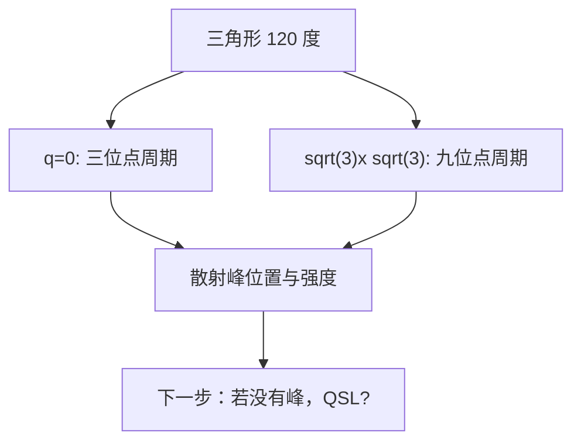

# Kagome 自旋如何排队：120 度、q=0 与 sqrt(3)x sqrt(3)

## 快速阅读版

单个三角形上的三个经典反铁磁自旋可以形成 \(120^\circ\) structure（120 度结构 / 120度構造）。可是 Kagome 有很多共享角的三角形：把这些 \(120^\circ\) 小单元铺满整张格子时，可以形成不同的 periodic magnetic order（周期磁序 / 周期磁気秩序）。

今天先认识两个常见名字：

- \(q=0\) state（\(q=0\) 态 / \(q=0\) 状態）：磁性周期与最小晶胞相容，每个 Kagome 单胞里的三种自旋方向重复下去。
- \(\sqrt{3}\times\sqrt{3}\) state（根号三乘根号三态 / \(\sqrt{3}\times\sqrt{3}\) 状態）：磁性超胞更大，包含九个位点的重复图案。

这两个名字不是咒语，而是告诉你：如果材料真的形成这种磁序，中子散射中的峰会出现在哪里。

## 今日主文献

**D. J. J. Farnell et al., _The Heisenberg antiferromagnet on the kagome lattice with arbitrary spin: A high-order coupled cluster treatment_**  
Journal: Physical Review B 84, 224428 (2011)  
Link: <https://doi.org/10.1103/PhysRevB.84.224428>  
Open preprint: <https://arxiv.org/abs/1110.3202>

为什么选它：论文明确以 \(q=0\) 和 \(\sqrt{3}\times\sqrt{3}\) 为 reference states（参考态 / 参照状態），适合学习这两个构型为什么在理论比较中出现。

注意：这是理论计算论文。它比较模型中的候选态，不等于某个真实样品已经观测到相同磁序。

## 从三角形到磁性超胞

昨天学到每个最近邻三角形喜欢三根自旋总和约为零。现在给三种方向取名为 A、B、C，三者两两相差 120 度。

**q=0 构型**

每个原胞都使用相同的 A、B、C 安排。它在实空间重复得快，因此 magnetic propagation vector（磁传播矢量 / 磁気伝播ベクトル）为 `q=0`。入门直觉是：不需要把晶胞放大就能描述自旋花纹。

**sqrt(3) x sqrt(3) 构型**

相邻三角形的手性或颜色排列以更长周期变化，必须把二维晶格方向都扩大根号三倍才能完整重复图案。入门直觉是：局部仍是 120 度，但全局拼法不同。

**chirality（手性 / カイラリティ）**

沿三角形绕一圈，自旋方向按顺时针还是逆时针旋转，是描述 120 度构型的重要额外信息。局部角度相同，不代表全局手性图案相同。

## 为什么这个区分会影响读论文

模型中多个候选态能量可能很近。研究者若只初始化一种磁构型，计算可能只收敛到一个 local minimum（局域极小值 / 局所極小値）。实验者若只看总磁化率，也未必能辨认空间周期。

因此，磁性结论需要问两层：

1. 有没有静态或准静态磁序？
2. 如果有，空间周期和自旋方向更像哪一种候选态？

## 数据分析流程：怎样从散射图确认磁序

**研究问题**

样品是否形成 \(q=0\) 或 \(\sqrt{3}\times\sqrt{3}\) 的 long-range magnetic order（长程磁有序 / 長距離磁気秩序）？

**原始数据**

- neutron diffraction（中子衍射 / 中性子回折）：冷却后出现的 magnetic Bragg intensity（磁布拉格强度 / 磁気ブラッグ強度）。
- elastic neutron scattering（弹性中子散射 / 弾性中性子散乱）：动量空间中的静态关联峰。
- 可辅助的 muSR 或磁化数据：判断是否存在静态冻结或相变。

**处理流程**

1. 测量高温背景与低温图谱。
2. 将核结构产生的峰与新增磁性峰区分开。
3. 根据候选磁结构计算允许的峰位置和相对强度。
4. 用 refinement（精修 / 精密化）或结构因子比较候选模型与实验强度。
5. 检查峰宽：尖锐峰更接近长程序；弥散散射说明短程关联或连续激发。

**结论边界**

- 若低温峰位置和强度符合一个候选磁结构，可支持该磁序模型。
- 若只有弥散强度而无清晰 Bragg 峰，则不应宣称观察到 \(q=0\) 或 \(\sqrt{3}\times\sqrt{3}\) 长程序。
- 若样品存在 disorder（无序 / 無秩序）或多相，峰的解释会更困难。

## 你读图时要圈出的东西

当你打开一篇磁性散射论文，先寻找：

- 图的横轴是 momentum transfer（动量转移 / 運動量移行）还是能量？
- 图中峰是 low-temperature minus high-temperature（低温减高温 / 低温差分）得到的吗？
- 作者有没有展示两种候选结构的 simulated pattern（模拟图谱 / 模擬パターン）？
- 结论说的是 ordered state（有序态 / 秩序状態），还是 short-range correlations（短程关联 / 短距離相関）？

## 实验与仪器清单

今天的主论文是理论论文，以下设备是“验证真实材料中磁构型时需要确认”的平台，不是主论文使用仪器表。

- `基础样品确认`：powder XRD、single-crystal XRD、Laue，用于确认相、晶向和单晶质量。
- `核心磁结构判定`：neutron diffraction 或 polarized neutron scattering（极化中子散射 / 偏極中性子散乱），通常需要大设施合作与足量样品。
- `静态磁性辅助`：SQUID、muSR，区分无序冻结与有序相变。
- `低能动力学`：inelastic neutron scattering、NMR，追踪涨落是否保留。

## 延伸阅读与可信度

- Liu, Li and Su, _Spin-ordered ground state and thermodynamic behaviors of the spin-3/2 kagome Heisenberg antiferromagnet_, Physical Review E 94, 032114 (2016): <https://doi.org/10.1103/PhysRevE.94.032114>. 论文明确描述 \(q=0\) 为三位点单胞、\(\sqrt{3}\times\sqrt{3}\) 为九位点结构；但讨论的是 \(S=3/2\) 模型，不能直接搬到 \(S=1/2\) 材料。
- Norman, RMP 2016: <https://doi.org/10.1103/RevModPhys.88.041002>. 用于从磁构型过渡到 herbertsmithite 的真实实验问题。
- Han et al., Nature 2012: <https://doi.org/10.1038/nature11659>. 下一阶段将读的原始中子散射实验。

风险备注：理论模型中的候选构型是比较基线；材料结论必须由结构、成分和散射等实验数据确认。

## 今日技能点

练习：为什么“每个三角形都呈 120 度”仍不能告诉你整张 Kagome 格子的磁性周期？

