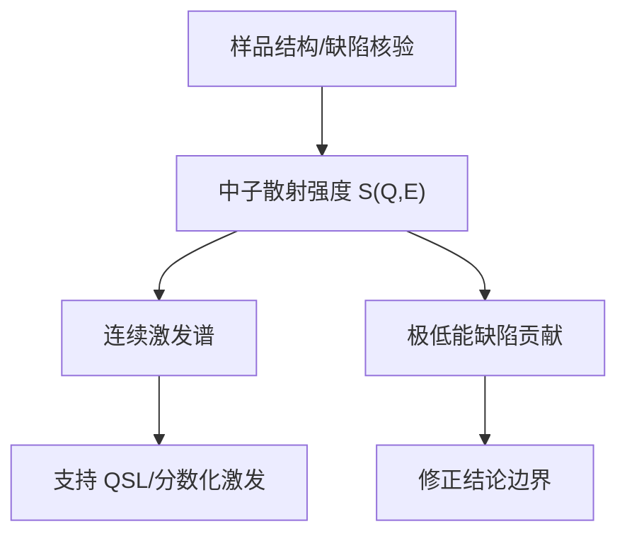

# 没有磁序还不够：herbertsmithite 的中子散射如何指向量子自旋液体

## 快速阅读版

quantum spin liquid（量子自旋液体 / 量子スピン液体）不是“自旋什么都不做”。它是自旋有强关联，却不凝结成普通长程磁序，并可能出现 fractionalized excitation（分数化激发 / 分数化励起）。

今天的主论文使用 single-crystal inelastic neutron scattering（单晶非弹性中子散射 / 単結晶非弾性中性子散乱）观察 herbertsmithite 的自旋激发。其关键不是一条整齐的 magnon（磁振子 / マグノン）色散，而是广泛的 excitation continuum（激发连续谱 / 励起連続体），由作者解释为支持自旋液体中的分数化激发。

重要警告：这是强证据，不是“所有低能细节已经结束争议”。后续研究指出最低能量区域可被 Cu/Zn 缺陷显著影响。

## 今日主论文

**T.-H. Han et al., _Fractionalized excitations in the spin-liquid state of a kagome-lattice antiferromagnet_**  
Journal: Nature 492, 406-410 (2012)  
DOI: <https://doi.org/10.1038/nature11659>  
Open preprint: <https://arxiv.org/abs/1307.5047>

作者与团队：Tian-Heng Han、Joel S. Helton、Shaoyan Chu、Daniel G. Nocera、Jose A. Rodriguez-Rivera、Collin Broholm、Young S. Lee 等，组合了材料合成与中子散射研究能力。该工作在 RMP 综述中被视为 herbertsmithite 证据链的重要节点。

## 样品先说清楚

herbertsmithite 的化学式常写为 `ZnCu3(OH)6Cl2`；中子实验常采用 deuterated sample（氘代样品 / 重水素化試料）`ZnCu3(OD)6Cl2`，因为氢在中子实验中可能产生强非相干背景，氘代有助于改善信号。

材料的磁性核心是 Kagome 层上的 `Cu2+` 自旋；理想情况下，层间位置由非磁性 `Zn2+` 隔开。现实难点是 Cu/Zn site mixing（铜锌位点混占 / Cu-Znサイト混合）：少量 Cu 进入层间位置会产生额外低能磁响应。

## 数据到底是什么

**测量对象**

非弹性中子把动量和能量传给样品，自旋体系的响应表现为 scattering intensity（散射强度 / 散乱強度）随 momentum transfer（动量转移 / 運動量移行）和 energy transfer（能量转移 / エネルギー移行）的分布。

**作者希望确认的问题**

如果体系是传统有序反铁磁体，低能自旋激发常出现相对清晰的 spin-wave dispersion（自旋波色散 / スピン波分散）。如果是分数化激发，自旋翻转可能分解成更分散的激发组合，从而出现宽广连续谱。

**观察到的核心信号**

Han 等人报告了单晶样品上的连续自旋激发响应，并将其作为 herbertsmithite 自旋液体状态中分数化激发的关键指纹。此处用词要谨慎：论文提供“evidence（证据 / 証拠）”，而不是把所有候选理论模型唯一化。

## 从图到结论的分析流程

**第一步：准备可用样品**

- 需要足量、可定向的氘代单晶，以获得可解析的动量信息并降低含氢背景。
- 先通过结构/组成手段理解样品是否接近目标相以及缺陷规模。

**第二步：收集中子响应**

- 原始数据是探测器计数随动量和能量的分布。
- 实际处理必然涉及背景校正、仪器响应、样品取向和强度归一化；阅读原论文 methods 和 supplement 时要专门寻找这些步骤。

**第三步：识别连续谱而不是有序模式**

- 看响应是否局限于少数清晰色散支，还是覆盖较宽的动量/能量区域。
- 观察最低可达温度下是否出现普通磁序相关的清晰静态特征。

**第四步：与解释相连**

- 宽广 continuum 与没有普通磁序共同支持量子自旋液体解释。
- 但 continuum 本身可能受无序、额外相互作用或低能缺陷贡献影响，需要更多局域探针和不同能量窗口的数据。

## 后续修正：低能信号中的缺陷

Han、Norman、Wen 等在 Physical Review B 94 (2016) 进一步报告：在非常低的能量转移 \\(E < 0.8\ \mathrm{meV}\\) 区域，散射的动量依赖与较高能量的 Kagome 本征自旋响应明显不同，并可由层间 Cu impurities（铜杂质 / Cu不純物）之间的短程关联解释。

来源：NIST publication page / PRB 94: <https://www.nist.gov/publications/correlated-impurities-and-intrinsic-spin-liquid-physics-kagome-material-herbertsmithite>

这教给你的不是“前论文作废”，而是实验判断的成熟姿势：

- 较高能量连续谱可携带本征 Kagome 物理的信息。
- 极低能响应需要主动拆分缺陷贡献。
- 任何声称“看到了基态”的说法，都要问测量能标是否落在缺陷敏感区域。

## 合成、样品质量与仪器盘点

**论文/同方向实验明确涉及或强关联的仪器**

- single-crystal inelastic neutron scattering facility（单晶非弹性中子散射平台 / 単結晶非弾性中性子散乱施設）：主数据来源，通常需大型设施机时。
- crystal alignment/orientation setup（晶体定向设备 / 結晶方位調整設備）：单晶散射前的必要环节。

**制备氘代 herbertsmithite 路线可能需要**

- hydrothermal autoclave（水热反应釜 / 水熱オートクレーブ），以及对含氘溶液兼容的内衬与安全管理。
- analytical balance、通风橱、干燥与样品筛选工具。
- 对重水/氘代试剂采购和污染控制的能力。

**验证样品是否值得送去大设施**

- powder/single-crystal XRD：确认目标相、晶格信息和杂相。
- ICP-AES/ICP-OES、EPMA/WDS 或 EDS：确认元素组成。
- XPS 与 TGA/MS：在需要时检查化学状态和热稳定性。
- SQUID：检查宏观磁化率与异常。
- NMR：区分本征 Kagome 层响应与缺陷附近响应。

这里的表征列表与 2020 Journal of Crystal Growth 的 aqueous solution growth（溶液生长 / 水溶液成長）研究相呼应，该文明确列出 XRD、XPS、EPMA/WDS、ICP/AES、TGA/MS 与磁化率测量：<https://doi.org/10.1016/j.jcrysgro.2019.125372>.

## 术语随身卡

**quantum spin liquid（量子自旋液体 / 量子スピン液体）**：具有强量子关联而缺少普通长程磁序的一类状态。  
**inelastic neutron scattering（非弹性中子散射 / 非弾性中性子散乱）**：测量自旋/晶格激发能量和动量结构的方法。  
**excitation continuum（激发连续谱 / 励起連続体）**：不是单一清晰模式，而是在较宽能量/动量区域存在响应。  
**site mixing（位点混占 / サイト混合）**：不同元素进入彼此理想晶位，引入缺陷信号。  
**deuteration（氘代 / 重水素化）**：以氘替换氢，常用于降低中子背景。

## 延伸阅读

- Norman, RMP 2016: <https://doi.org/10.1103/RevModPhys.88.041002>. 适合把原始实验放回整个领域框架。
- Olariu et al., PRL 2008: <https://doi.org/10.1103/PhysRevLett.100.087202>. 用 `17O NMR` 区分本征响应与 Zn/Cu 交换缺陷。
- Han et al., PRB 2016 / NIST entry: <https://www.nist.gov/publications/correlated-impurities-and-intrinsic-spin-liquid-physics-kagome-material-herbertsmithite>. 学习低能缺陷修正。

## 今日练习与技能点

练习：用三行话区分“未发现磁序”“发现连续激发”“唯一证明某种自旋液体理论”这三个结论的证据强度。

