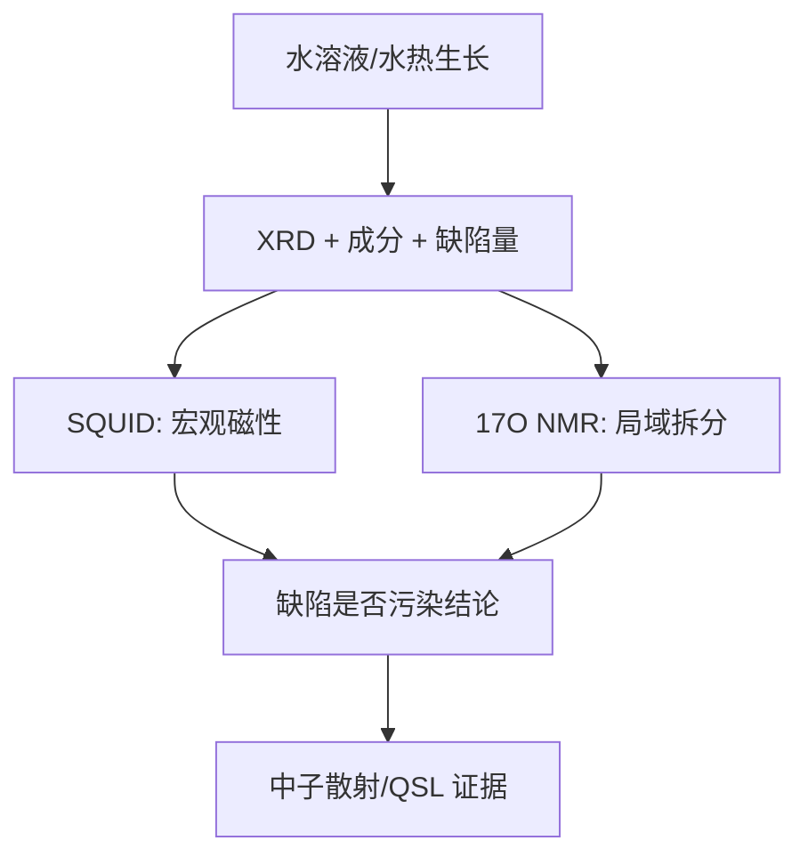

# 把理想模型做成样品：herbertsmithite 的合成、位点混占与 NMR 证据

## 快速阅读版

理想模型说 Kagome 层由 `S=1/2` 的 Cu 自旋组成，层间由不带磁矩的 Zn 隔开。但真实合成中 Cu 和 Zn 可能换位：site mixing（位点混占 / サイト混合）会让层外多出磁性 Cu，也可能稀释 Kagome 层。

所以研究 herbertsmithite 的第一道硬门槛不是理论，而是材料学问题：你做出的样品是否真的足够接近理想 Kagome 层？

今天把两条证据链合起来读：

- 合成/结构表征告诉你“样品有什么缺陷”。
- `17O NMR` 告诉你“宏观磁化信号里哪些可能来自本征 Kagome 层，哪些靠近缺陷”。

## 主文献组合

**材料发现入口**  
Shores, Nytko, Bartlett and Nocera, _A Structurally Perfect S = 1/2 Kagome Antiferromagnet_  
Journal: Journal of the American Chemical Society 127, 13462-13463 (2005)  
DOI: <https://doi.org/10.1021/ja053891p>

**合成与设备/表征入口**  
_Aqueous solution growth at 200 C and characterizations of pure, 17O- or D-based herbertsmithite single crystals_  
Journal: Journal of Crystal Growth 531, 125372 (2020)  
DOI: <https://doi.org/10.1016/j.jcrysgro.2019.125372>

**局域磁性数据入口**  
Olariu et al., _17O NMR Study of the Intrinsic Magnetic Susceptibility and Spin Dynamics of the Quantum Kagome Antiferromagnet ZnCu3(OH)6Cl2_  
Journal: Physical Review Letters 100, 087202 (2008)  
DOI: <https://doi.org/10.1103/PhysRevLett.100.087202>

## 为什么要走水溶液/水热生长路线

herbertsmithite 是含 hydroxide（氢氧根 / 水酸基）与 chloride（氯化物 / 塩化物）的铜锌化合物。对于这种相，aqueous solution growth（水溶液生长 / 水溶液成長）或 hydrothermal growth（水热生长 / 水熱成長）提供了在含水环境中形成羟基氯化物晶格的路径，而不是把所有元素简单高温烧结。

2020 年 Journal of Crystal Growth 论文标题明确给出 `200 C` 的水溶液生长，并报告得到毫米尺度、纯的或 `17O`/氘代的单晶。论文还报告生长温度与组成/位点混占量之间存在关系。这意味着温度不是“抄来的参数”，而是同时影响晶体生长和缺陷化学的变量。

**你该怎样理解温度和时间**

- 温度影响溶解、成核、晶体长大与 Cu/Zn 占位平衡；不能只追求长出晶体而忽略混占。
- 时间决定晶体能否长到足够用于 NMR/中子实验的尺度，但较长时间不自动保证缺陷更低。
- 要优化的是“可测的大晶体 + 可接受的混占 + 可重复的组成”，而非单一外观。

## 数据分析一：合成论文确认了什么

2020 生长研究在摘要中明确报告了以下表征组合：

- powder XRD（粉末 XRD / 粉末XRD）：检查结构相。
- XPS（X 射线光电子能谱 / X線光電子分光）：化学状态/表面组成信息。
- EPMA/WDS（电子探针/波长色散谱 / 電子線プローブ・波長分散分光）与 ICP/AES：元素组成。
- TGA/MS（热重-质谱联用 / 熱重量・質量分析）：热稳定性或分解释放物信息。
- magnetic susceptibility（磁化率 / 磁化率）：宏观磁响应。

论文摘要报告 antisite disorder（反位缺陷 / アンチサイト欠陥）约 `8-12%`，并将其与样品组成范围联系起来。它支持的结论是“即便获得高品质单晶，Cu/Zn 混占仍是必须量化的问题”；它不能单独回答基态是哪一种自旋液体。

## 数据分析二：NMR 如何区分本征与缺陷

bulk susceptibility（体磁化率 / バルク磁化率）把整个样品的磁性加在一起，缺陷贡献会混入其中。NMR（核磁共振 / 核磁気共鳴）是 local probe（局域探针 / 局所プローブ），不同局域环境的氧核可能给出可区分的谱线或位移。

Olariu 等人 2008 年 PRL 报告使用 `17O NMR` 对 herbertsmithite 的 intrinsic kagome lattice spin susceptibility（本征 Kagome 层自旋磁化率 / 本質的カゴメ層スピン磁化率）以及由自然 Zn/Cu 交换造成的缺陷附近响应进行局域判断。

**证据链**

1. 制备可进行 `17O` 探测的样品。
2. 测量 NMR spectrum（NMR 谱 / NMRスペクトル）和随温度变化的 Knight shift（奈特位移 / ナイトシフト）或弛豫信息。
3. 将主要局域环境与靠近缺陷的环境分辨开。
4. 比较局域磁化率与宏观磁化率：若二者低温行为不同，则体信号可能被缺陷污染。

**支持到哪里**

- 支持：缺陷响应与 Kagome 层本征响应可显著不同，读宏观磁性必须考虑位点混占。
- 不直接支持：NMR 一项实验不能独自决定所有量子自旋液体低能理论细节。

## 你需要向实验室确认的所有关键仪器类别

以下按“制备、基础确认、局域/物性、深度验证”列出。具体论文是否逐项用了某设备，要以原文 methods 和 supporting information 为准。

**合成与晶体生长**

- hydrothermal autoclave / pressure vessel（水热反应釜 / 水熱オートクレーブ）：需核实温压上限、内衬材质、使用资质和安全 SOP。
- programmable oven or furnace（可编程恒温炉/电炉 / プログラム炉）：维持生长温度与受控温度历史。
- analytical balance（分析天平 / 分析天秤）、通风橱、样品洗涤/干燥设备。
- 若做 `17O` 或 deuterated sample（氘代样品 / 重水素化試料）：对应富集试剂处理、回收与污染控制能力。

**相与组成确认**

- powder XRD；如有单晶则确认 single-crystal XRD。
- EPMA/WDS 或 EDS，用于微区成分。
- ICP-AES/ICP-OES，用于整体元素比例。
- XPS，用于补充化学状态和表面信息。
- TGA/MS，用于热稳定性与潜在分解分析。

**磁性与局域探针**

- SQUID magnetometer，用于磁化率随温度/场变化。
- NMR spectrometer，若要直接复现 `17O NMR` 逻辑，还需同位素样品和相应探头/磁场条件。
- PPMS heat-capacity option，用于比热证据链。
- muSR 平台通常属于合作/大设施，用于检验静态磁场或慢涨落。

**动量与能量分辨的深度证据**

- neutron diffraction / inelastic neutron scattering，需要合适单晶/氘代样品、样品定向工具以及大型中子设施合作。

**仪器缺口如何影响项目**

- 没有 XRD 与组成测量：无法先判断“做出来的是什么”。
- 没有 SQUID/NMR 合作：很难把缺陷和本征磁性拆开。
- 没有大设施渠道：仍可做材料优化和基础物性，但难以直接推进分数化激发证据。

## 术语随身卡

**aqueous solution growth（水溶液生长 / 水溶液成長）**：以水溶液环境促进晶体形成的生长方法。  
**antisite disorder（反位缺陷 / アンチサイト欠陥）**：两个元素在理想晶位之间交换占据。  
**intrinsic susceptibility（本征磁化率 / 本質磁化率）**：希望归属于目标晶格自身的响应。  
**Knight shift（奈特位移 / ナイトシフト）**：NMR 中与局域磁化响应相关的谱线位移。  
**characterization（表征 / 評価・キャラクタリゼーション）**：确认材料结构、成分与性质的测量链。

## 作者/来源可信度与阅读顺序

- Shores et al. 2005 是材料发现早期入口；适合读化学结构与提出问题的方式。
- Olariu et al. 2008 是分辨缺陷与本征磁性的关键局域探针工作。
- 2020 生长论文尤其适合你关心的“怎么合成、什么设备核验、缺陷怎样随条件改变”。
- Norman RMP 2016: <https://doi.org/10.1103/RevModPhys.88.041002>，用于整合争议和后续路线。

风险备注：本篇只基于出版论文和公开摘要列出已报道表征；具体反应物比例、装釜条件与安全步骤必须回到原文并由实验室导师审核。

## 今日技能点

练习：假设某样品的 SQUID 低温磁化率上翘，但 NMR 主谱线没有相同上翘，你会优先怀疑什么？还需要哪项结构/组成数据来支持这个怀疑？

