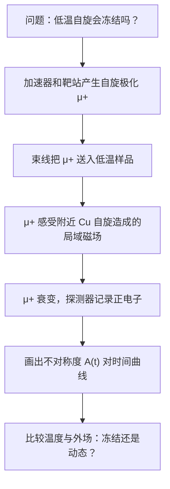

# 自旋没有冻住是什么意思：从 μSR 仪器到 herbertsmithite 的低温动态

## 快速阅读版

昨天我们看到 herbertsmithite 的现实难题：它的 Kagome 层可能具有特别的低温磁性，但真实样品中 Cu/Zn 混占会干扰读数。今天先不背抽象结论，而是学习一个实验问题：自旋是否在极低温冻成近乎静态的状态，还是仍保持动态？

μSR 把大量有已知初始自旋方向的正缪子送进样品。每个缪子感受到附近磁场，随后衰变为正电子；探测器统计正电子方向随时间怎样变化，于是研究者可以得到局域磁性是否静止的线索。

Mendels 等人在 2007 年 PRL 论文中报告，对 paratacamite 系列做 μSR 测量时，herbertsmithite 对应的 `x=1` 样品即使冷到 \\(50\\,\mathrm{mK}\\)，仍未观察到向 magnetic frozen state（磁冻结态 / 磁気凍結状態）的转变。严谨说法是“在该实验可见范围内未见冻结”，而不是“一个实验已经证明唯一的量子自旋液体理论”。

不熟悉仪器时，先读入口：[μSR 是什么：用会衰变的微小探针寻找磁冻结]({{ '/methods/musr-zero-start/' | relative_url }})。

## 今天要回答的四个问题

1. 为什么“没有冻结”对 Kagome 材料重要？
2. μSR 的仪器路径与测量过程是什么？
3. 一张时间曲线怎样被用于判断冻结或动态？
4. 这一判断能证明什么，仍不能证明什么？

## 先认识五个词

**herbertsmithite（赫伯特史密斯石 / ハーバースミサイト）**：化学式常写作 `ZnCu3(OH)6Cl2` 的 Kagome 量子磁体候选。  
**magnetic freezing（磁冻结 / 磁気凍結）**：自旋在测量时间尺度上停在静态或非常缓慢的排列。  
**dynamic spin fluctuations（动态自旋涨落 / 動的スピン揺らぎ）**：自旋仍随时间改变。  
**local probe（局域探针 / 局所プローブ）**：读取材料内部局部环境的实验方法，μSR 与 NMR 都属于这一类。  
**Weiss temperature（外斯温度 / ワイス温度）**：从磁化率拟合得到的相互作用尺度；它很大并不等于材料一定在同样温度附近冻结。

## 主论文：先知道来源，再听结论

P. Mendels, F. Bert, M. A. de Vries, A. Olariu, A. Harrison, J.-C. Trombe, F. Duc, J. S. Lord, A. Amato and C. Baines, _Quantum Magnetism in the Paratacamite Family: Towards an Ideal Kagome Lattice_, Physical Review Letters 98, 077204 (2007).  
DOI: <https://doi.org/10.1103/PhysRevLett.98.077204>

**为什么选择它**：这篇一手论文直接把 μSR 用在 herbertsmithite 所属材料系列上，并在摘要中明确报告最低温度和“未见冻结”这一条谨慎结论。

**阅读顺序**：先从摘要取出对象、方法、温度与结论；再在方法和图注中找样品组成、零场/纵场条件；最后查看讨论有没有承认缺陷和理论边界。

## 仪器、过程、输出：从设备到曲线

- **仪器**：缪子源、束线、低温样品环境和正电子探测器，通常属于大型设施合作，不是台式设备。
- **过程**：植入许多 \\(\mu^+\\)，按衰变时间统计正电子方向分布。
- **输出**：探测器计数被整理为随时间变化的不对称度 \\(A(t)\\)。
- **目标**：发现局域磁场是否出现静态/准静态成分，还是仍主要动态。

PSI 官方方法说明指出，正缪子到达样品时高度自旋极化；正电子的优选发射方向携带缪子自旋极化信息。这正是从探测器计数走到磁性曲线的桥梁。

## 第一张结果图：横轴和纵轴到底是什么

常见教学表达式为：

\\[
A(t) = A_0 P(t)
\\]

- 横轴 \\(t\\)：缪子进入样品后的时间，常是微秒量级。
- 纵轴 \\(A(t)\\)：前后探测器计数不对称度，与保留下来的自旋方向信息相关。
- \\(P(t)\\)：局域磁场使缪子极化怎样随时间变化。

降温后若曲线突然快速衰减、振荡或明显丢失初始幅度，需要怀疑静态或准静态磁场。作者若再做纵场测量，观察信号是否被解耦，就更有条件区分静态成分和动态涨落。还必须检查样品架、容器背景以及缺陷造成的信号。

## 从观察量到结论：一步不能跳

**问题**  
强反铁磁关联是否最终使 herbertsmithite 自旋冻结？

**样品条件**  
paratacamite 系列 `Zn_xCu_(4-x)(OH)6Cl2`，重点关注 `x=1`；温度降到 \\(50\\,\mathrm{mK}\\)。

**原始观察量**  
μSR 时间谱：不对称度和自旋弛豫如何随温度、组成与测量条件改变。

**处理与比较**  
比较不同组成的低温曲线是否出现冻结特征，并依照论文说明考虑拟合和背景。

**论文支持的结论**  
论文摘要报告，`x=1` 化合物没有在 \\(50\\,\mathrm{mK}\\) 以上转变到磁冻结态；系列中动态与部分冻结基态之间的界限约在 `x=0.5` 附近。

**不能由它单独证明的结论**

- 不能单靠 μSR 决定量子自旋液体属于哪一种理论类型。
- 不能单靠“未冻结”排除所有缺陷效应。
- 不能替代后来高质量单晶、NMR 与中子散射的交叉核验。

## 它和 NMR、中子实验怎样互补

- NMR 选择某种原子核读取附近环境，适合分离本征信号与缺陷附近响应。
- μSR 对非常弱的静态或缓慢局域场敏感，适合问“有没有冻住”。
- 中子散射进一步给出随动量和能量分辨的激发谱。

它们不是同一个结论按钮：三者看见的可观察量不同，结论互相支持或互相提醒检查样品问题。

## 设备与安全边界

这类研究要确认：缪子束线、低温样品环境、正电子探测系统，以及 XRD/组成分析/SQUID 等样品质量验证手段。μSR 通常要向大型用户设施申请机时。低温、高场与束流操作必须遵守设施培训和规程；本篇不提供设备操作步骤。

## 阅读练习

某个样品在最低温度下没有出现明显静态冻结信号。请写下：一个能谨慎支持的结论、两个仍未排除的解释，以及两项希望和 μSR 一起看到的测量。参考方向：结论必须限定在温度与实验时间尺度内；补充测量可考虑 NMR、结构/缺陷表征或中子散射。

## 相关阅读、可靠性与下一步

- Mendels et al., 2007, PRL 98, 077204：主论文，建立 μSR 未冻结证据链。<https://doi.org/10.1103/PhysRevLett.98.077204>
- Olariu et al., 2008, PRL 100, 087202：用 \\(^{17}\mathrm{O}\\) NMR 分离本征与缺陷响应。<https://doi.org/10.1103/PhysRevLett.100.087202>
- Han et al., 2012, Nature 492, 406-410：中子散射连续激发入口。<https://doi.org/10.1038/nature11659>
- Norman, 2016, Reviews of Modern Physics 88, 041002：证据与争议综述。<https://doi.org/10.1103/RevModPhys.88.041002>

本文的仪器原理采用 PSI 官方说明；关于未见冻结的数字采用 Mendels 等人同行评议论文摘要。流程图和练习是教学材料，不是原论文数据复刻。风险等级：中，因为低温量子磁性仍需多探针和样品质量共同判断。

下一步：学习 Kagome 能带的平带、Dirac 点和 van Hove 奇点，把绝缘体自旋问题连接到金属 Kagome 材料。
