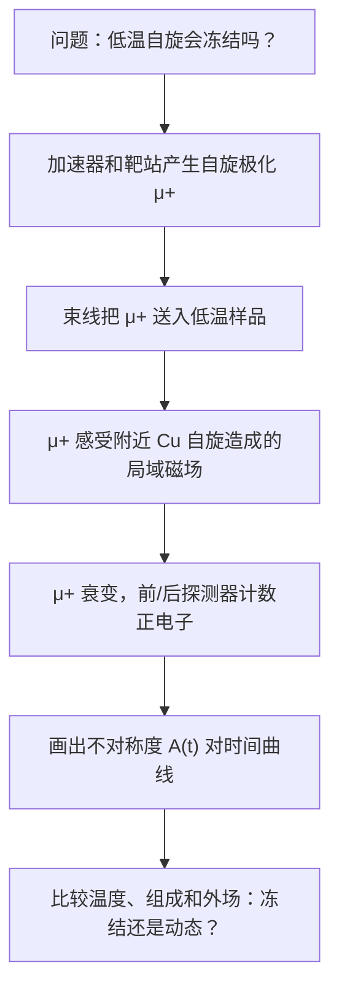

# 自旋没有冻住是什么意思：从 μSR 仪器到 herbertsmithite 的低温动态

## 快速阅读版

昨天我们知道了 herbertsmithite 的难题：理想 Kagome 层可能具有非常特别的低温磁性，但真实样品有 Cu/Zn 混占，不能只看一条整体磁化率曲线就下结论。

今天学习另一种局域探针：μSR。你可以把它想成把大量“会自己报时并留下方向线索的小探针”送入样品：每一个正缪子停下来后感受到附近磁场，过一会儿衰变为正电子；探测器统计正电子飞出的方向随时间怎样改变，从而得到局域磁性是否静止、是否仍在波动的线索。

Mendels 等人在 2007 年的 PRL 论文中报告，对 paratacamite 系列做 μSR 测量时，herbertsmithite 对应的 \\(x=1\\) 样品即使冷到 \\(50\\,\mathrm{mK}\\)，仍未观察到向 magnetic frozen state（磁冻结态 / 磁気凍結状態）的转变。严谨说法是“在该实验可见范围内未见冻结”，而不是“一个实验已经证明唯一的量子自旋液体理论”。

不熟悉仪器时，先读配套入口：[μSR 是什么：用会衰变的微小探针寻找磁冻结]({{ '/methods/musr-zero-start/' | relative_url }})。

## 今天要回答的四个问题

1. 为什么“自旋没冻结”对 Kagome 材料重要？
2. μSR 的仪器路径和测量过程究竟是什么？
3. 时间曲线中的变化如何变成“冻结/未冻结”的判断？
4. 这一结论说到了哪里，哪里仍然需要别的实验？

## 先认识五个词

**herbertsmithite（赫伯特史密斯石 / ハーバースミサイト）**：常写作 \\(\mathrm{ZnCu}_3(\mathrm{OH})_6\mathrm{Cl}_2\\) 的 Kagome 量子磁体候选。  
**magnetic freezing（磁冻结 / 磁気凍結）**：自旋在测量时间尺度上停在某种静态或非常慢的无序/有序排列。  
**dynamic spin fluctuations（动态自旋涨落 / 動的スピン揺らぎ）**：自旋仍随时间变化，不像被冻结。  
**local probe（局域探针 / 局所プローブ）**：感受材料内部局部环境的实验方法；μSR 与 NMR 都属于这一类。  
**Weiss temperature（外斯温度 / ワイス温度）**：从磁化率拟合得到、反映相互作用尺度的温度参数；它很大并不等于材料一定在同样温度附近冻结。

## 主论文：先知道来源，再听结论

P. Mendels, F. Bert, M. A. de Vries, A. Olariu, A. Harrison, J.-C. Trombe, F. Duc, J. S. Lord, A. Amato and C. Baines, _Quantum Magnetism in the Paratacamite Family: Towards an Ideal Kagome Lattice_, Physical Review Letters 98, 077204 (2007).  
DOI: <https://doi.org/10.1103/PhysRevLett.98.077204>

**为什么选择它**：这篇一手论文直接把 μSR 用在 herbertsmithite 所属的材料系列上，且摘要清楚陈述了读者最需要学习的一条证据边界：强相互作用背景下，\\(x=1\\) 样品直到极低温仍未显示冻结转变。

**如何分段读**：

- 摘要：只提取研究对象、测量方法、最低温度和最谨慎结论。
- 方法和图注：寻找样品组成、温度、零场/纵场条件与曲线比较方式。
- μSR 结果图：查看低温下是否出现静态冻结常见的强信号变化。
- 讨论：查看作者如何连接“动态/部分冻结边界”和 Kagome 模型，而不是把讨论误当为直接测量事实。

## 仪器、过程、输出：一个完整可跟随的路线

这不是“按按钮就得到答案”的机器。每一步都有需要核查的地方：

- **仪器**：μSR 需要缪子源、束线、低温样品环境与正电子探测器，通常属于大型设施合作，不是普通实验室台式设备。
- **过程**：向样品植入大量已知初始自旋方向的 \\(\mu^+\\)，按其衰变时间记录正电子方向分布。
- **输出**：电脑先得到探测器计数，再形成随时间变化的不对称度 \\(A(t)\\)。
- **目标**：判断局域磁场在实验时间尺度内是否出现静态/准静态成分，或仍主要保持动态。

PSI 的官方方法说明指出，正缪子以高度自旋极化状态到达样品，正电子的优选发射方向能够读出缪子自旋极化信息。这就是“看不到自旋本身，却能画出时间曲线”的桥梁。

## 第一张结果图：不要怕横轴和纵轴

最常见的教学形式是：

\\[
A(t) = A_0 P(t)
\\]

- 横轴 \\(t\\)：缪子进入样品后的时间，通常是微秒量级。
- 纵轴 \\(A(t)\\)：前后探测器计数不对称度，与缪子群体保留的自旋极化信息相关。
- \\(P(t)\\)：样品局域磁场使缪子自旋随时间变化的部分。

你读图时应先问三句：

1. 降温后曲线是否突然出现快速衰减、振荡或明显丢失初始幅度？这可能提示静态/准静态磁场出现。
2. 作者是否通过纵场测量检查该信号能否被解耦？这有助于区分静态与动态来源。
3. 作者是否扣除样品架、容器或背景信号，并比较不同样品组成？没有这些，曲线变化未必来自目标 Kagome 层。

## 从观察量到结论：这一条链必须完整

**问题或假设**  
herbertsmithite 的强反铁磁关联最终会不会在低温造成传统磁冻结？

**样品条件**  
paratacamite 系列 \\(\mathrm{Zn}_x\mathrm{Cu}_{4-x}(\mathrm{OH})_6\mathrm{Cl}_2\\)，重点关注 \\(x=1\\)；温度降到 \\(50\\,\mathrm{mK}\\)。

**原始观察量**  
μSR 时间谱：不对称度/自旋弛豫如何随温度、组成和测量条件变化。

**处理和比较**  
比较不同 \\(x\\) 的行为，考察低温曲线是否显示冻结特征，并在论文模型/拟合假设下归纳动态与部分冻结的边界。

**论文支持的结论**  
论文摘要报告，\\(x=1\\) 化合物没有在 \\(50\\,\mathrm{mK}\\) 以上转变到磁冻结态；系列中动态与部分冻结基态之间的界限出现在约 \\(x=0.5\\) 附近。

**不能被这一条链单独证明的结论**  

- 不能单靠这一实验决定量子自旋液体究竟属于哪一种理论类型。
- 不能单靠“未冻结”排除所有缺陷效应。
- 不能用 2007 年系列样品的一项结论替代后来高质量单晶、NMR 与中子散射的交叉核验。

## 它和昨天 NMR 文章是什么关系

NMR 与 μSR 都是局域探针，但它们不是重复按钮：

- NMR 选择某种原子核来读它附近的局域环境，特别适合讨论不同谱线成分、位点和缺陷附近信号。
- μSR 把缪子作为外来微小探针植入样品，对非常弱的静态或缓慢磁场很敏感，适合问“是否冻住”。
- 两者如果都支持低温仍以动态行为为主，可信度会比任何单项结果更高；若它们不一致，反而提醒研究者检查缺陷、时间尺度或样品差异。

## 如果你所在实验室要开展这类研究

**主论文明确涉及或实验逻辑必需的设施**：缪子束线、低温样品环境、正电子探测系统、样品的基本磁性与结构确认。μSR 通常需要向大型用户设施申请机时。

**样品质量验证需要确认的资源**：XRD/单晶衍射、元素组成分析、SQUID 磁测量；如果样品中的 Cu/Zn 混占没有被量化，μSR 的物理解释会更难。

**安全边界**：低温、高场与束流操作必须服从设施培训与操作规程；本篇不提供设备操作步骤。

## 阅读练习：你能否抵抗“过度结论”

你看到如下信息：某个样品在最低温度下没有出现明显静态冻结信号。请分别写下：

- 一个可以谨慎支持的结论；
- 两个仍然没有被排除的解释；
- 两项你希望与 μSR 一起看到的额外测量。

参考方向：谨慎结论应限定在测量温度与时间尺度内；额外测量可考虑 NMR、结构/缺陷表征或中子散射。

## 相关阅读

- Mendels et al., 2007, PRL 98, 077204：今日主论文，困难度中等；用于建立 μSR 未冻结证据链。<https://doi.org/10.1103/PhysRevLett.98.077204>
- Olariu et al., 2008, PRL 100, 087202：用 \\(^{17}\mathrm{O}\\) NMR 分离本征与缺陷响应，困难度中等。<https://doi.org/10.1103/PhysRevLett.100.087202>
- Han et al., 2012, Nature 492, 406-410：中子散射连续激发入口，困难度较高。<https://doi.org/10.1038/nature11659>
- Norman, 2016, Reviews of Modern Physics 88, 041002：herbertsmithite 证据与争议综述，困难度中高。<https://doi.org/10.1103/RevModPhys.88.041002>

## 可靠性说明与下一步

本文关于 μSR 仪器原理采用 PSI 官方说明；关于 herbertsmithite 未见冻结的明确数字采用 Mendels 等人同行评议论文的摘要信息。流程图、读图路线和练习是教学材料，不是原论文数据复刻。风险等级：中，原因是低温量子磁性必须依靠多探针和样品质量共同判断。

下一步可以学习 Kagome 能带中的平带、Dirac 点与 van Hove 奇点，逐步把绝缘体自旋问题连接到金属 Kagome 材料。
