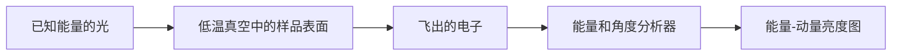

# Kagome 能带：平带、Dirac 点和 van Hove 奇点怎样看

## 今天的问题

前几天我们在问磁矩是否排列、是否冻结。今天进入 Kagome 金属：材料中能移动的电子，在由三角形和六边形组成的网格里，会形成怎样的能量路线？

论文常说的**平带**、**Dirac 点**和 **van Hove 奇点**，首先都是能带图上可以寻找的形状。先认得图，再讨论它们可能与磁性、电荷序或超导有什么关系。

## 能带图上的四个基础词

| 名词 | 直观含义 | 图上先找什么 |
| --- | --- | --- |
| 能带 | 晶体允许电子拥有的能量路线 | 随横轴起伏的线 |
| 动量 | 电子波在周期晶格中的行进节奏标签 | 横轴 `Γ -> K -> M -> Γ` |
| 费米能级 EF | 最靠近低能电子行为的分界附近 | 纵轴 `E - EF = 0` 附近 |
| 态密度 DOS | 某个能量附近可用状态多少 | 某些能量处的增强 |

`Γ`、`K`、`M` 可先理解为六边形动量地图中约定的三个代表地点。

## 仪器怎样把能带测出来：ARPES

**角分辨光电子能谱**，简称 **ARPES**，不是直接拍摄电子在晶格中跑动的照片。它的基本路线是：

1. 准备真空与低温中的干净单晶表面。
2. 用已知能量的光照射样品，将部分电子打出表面。
3. 分析器记录电子离开时的能量与方向。
4. 将大量记录拼成能量-动量亮度图；亮线就是实验看到的能带信号。



这是一张读图用的教学示意，不等同于某一台真实仪器的完整工程图。

## 第一张结果图先这样读

| 图的部分 | 它表示什么 | 你先判断什么 |
| --- | --- | --- |
| 横轴 `Γ -> K -> M -> Γ` | 电子波在晶格中的不同位置标签 | 特征出现在哪里 |
| 纵轴 `E - EF` | 相对费米能级的能量 | 特征是否靠近低能区域 |
| 亮线或计算曲线 | 能带 | 它是平、交叉还是出现特殊转弯 |

第一遍读图不需要理解每条细线：先寻找下面三种形状即可。

## 三种形状速记图

下面是读图用的教学示意，不是某个样品的实验数据。纵向可先理解为能量，横向可先理解为动量路线。

```text
平带                 Dirac 点               van Hove 鞍点
能量                  能量                   能量
 ↑                     ↑                      ↑
 |  ─────────          |  ╲   ╱               |     ╱╲
 |                     |   ╲ ╱                |  ╲─●─╱
 |                     |    X                 |     ╲╱
 +-------> 动量        +-------> 动量          +-------> 动量
近水平                 两支相遇或开小缝       山口式转弯，附近状态增多
```

如果真实图很复杂，就先用这一张小图寻找相似轮廓，再看作者怎样标注与验证。

## 三种典型线索

### 平带：近水平的一条线

当一条能带在横轴变化时能量几乎不改变，它被称为平带。电子改变行进节奏却不太改变能量，电子间的相互影响可能因此更显眼。

Kang 等人在 CoSn 中结合 ARPES 与能带计算报告了 Kagome 相关平带。这支持真实材料中存在平带特征，却不等于单靠平带就已经证明了某种相变。

### Dirac 点：两条斜线相遇或开小缝

两条能带在某处像 X 一样相遇，附近可呈现 Dirac 特征。真实材料的磁性或自旋轨道耦合可能让交叉处出现小缝。

Ye 等人在铁磁 Kagome 金属 Fe3Sn2 中报告了有质量 Dirac 电子的证据，并将其与双层 Kagome、铁磁有序和自旋轨道耦合联系起来。

### van Hove 奇点：山口式的鞍点

一个方向像上坡、另一个方向像下坡的能带位置称为鞍点；其能量附近的态密度可能增强，这类特征称为 van Hove 奇点。

如果它靠近 EF，电子相互作用可能更重要。但它只是进一步研究电荷序或超导的线索，不是机制证明。

## 能说什么，不能跳到什么

| 观察到的特征 | 可以支持 | 不能自动证明 |
| --- | --- | --- |
| 接近平的能带 | 存在平带候选特征 | 必然形成超导或强关联新相 |
| Dirac 交叉或小开缝 | 对称性、磁性或自旋轨道耦合可能参与 | 拓扑性质已经完整证明 |
| EF 附近 van Hove 特征 | 态密度增强可能放大相互作用 | 电荷序或超导的唯一成因 |

## 今天的小练习

1. ARPES 经过哪四步得到能带图？
2. 图上哪三种形状分别对应平带、Dirac 点和 van Hove 奇点？
3. 为什么看到 van Hove 特征仍不能直接宣布超导机制？

## 参考原始论文

- M. Kang 等，*Topological flat bands in frustrated kagome lattice CoSn*, Nature Communications 11, 4004 (2020). [DOI](https://doi.org/10.1038/s41467-020-17465-1)
- L. Ye 等，*Massive Dirac fermions in a ferromagnetic kagome metal*, Nature 555, 638-642 (2018). [DOI](https://doi.org/10.1038/nature25987)
- B. R. Ortiz 等，*New kagome prototype materials: discovery of KV3Sb5, RbV3Sb5, and CsV3Sb5*, Physical Review Materials 3, 094407 (2019). [DOI](https://doi.org/10.1103/PhysRevMaterials.3.094407)

下一篇物理主线将进入 AV3Sb5：为什么能带线索会把人们带到电荷密度波与超导的实验问题。
